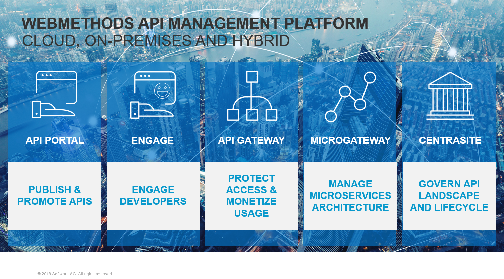
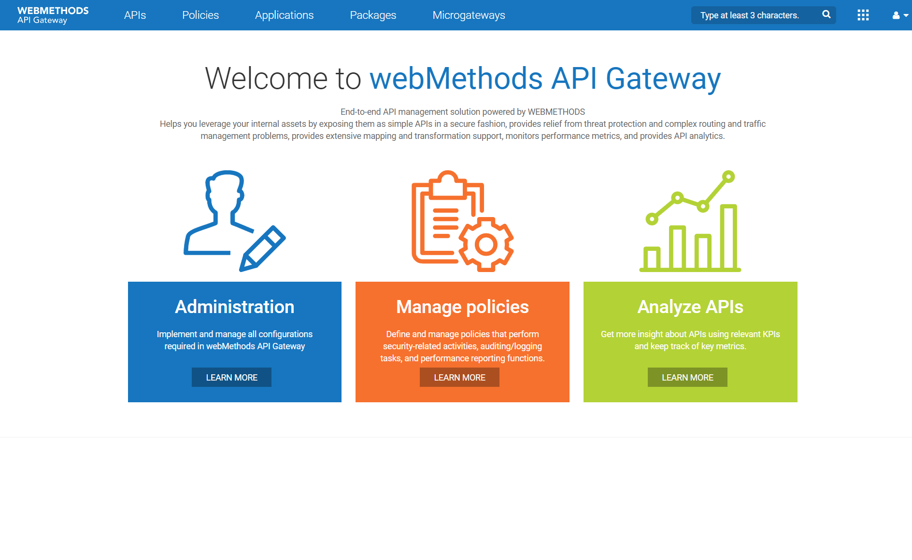
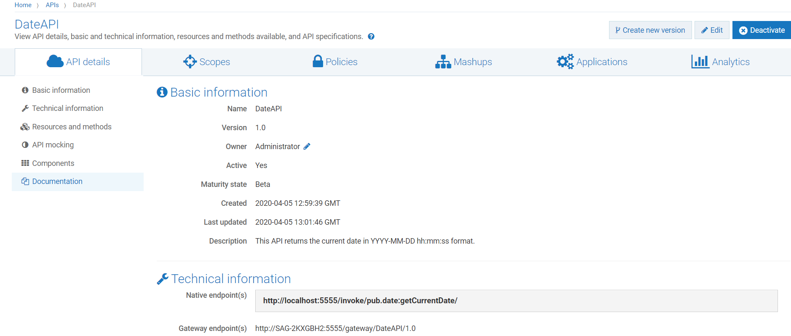
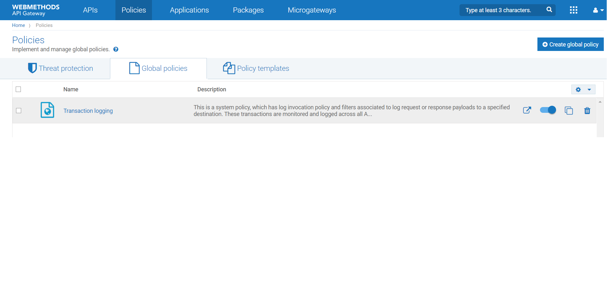
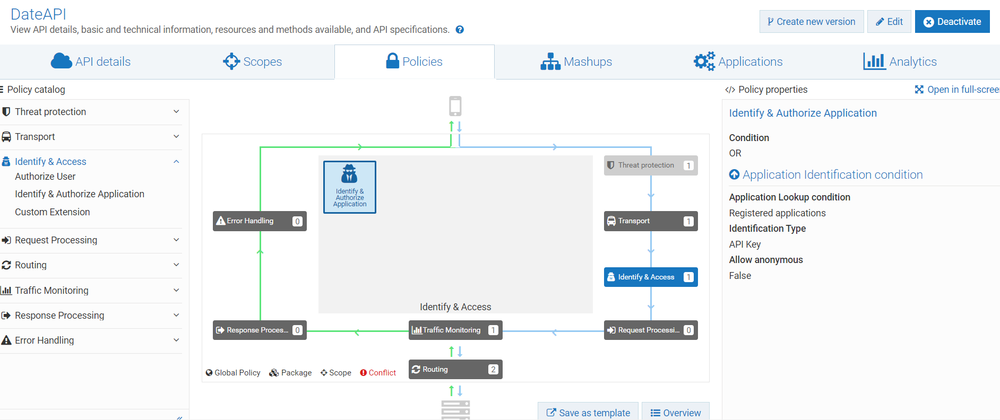
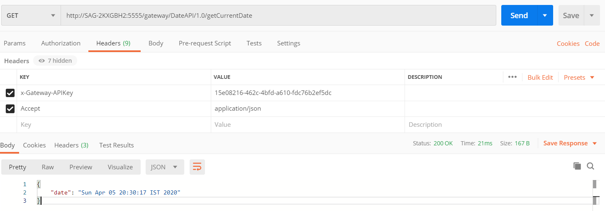
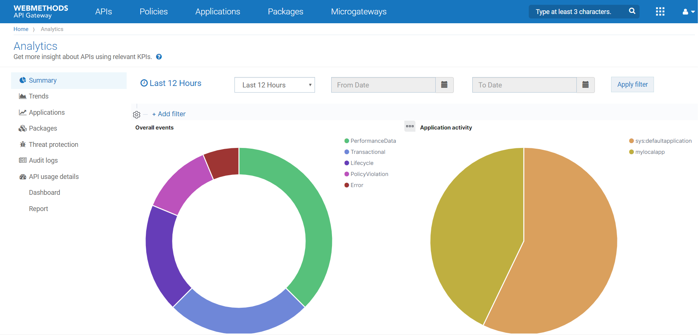
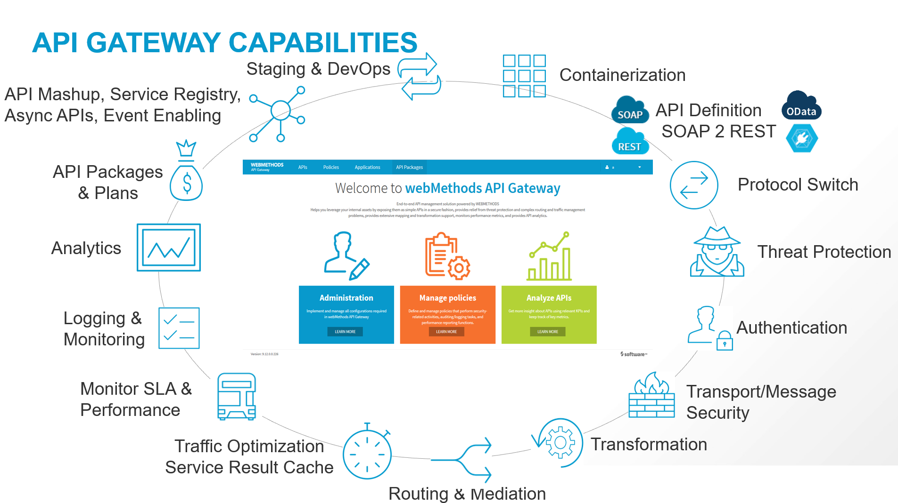

webMethods API Gateway
==============================================

webMethods API Gateway is the core run time component in [webMethods API Management platform](https://www.softwareag.com/corporate/products/api/default.html) and it enables organizations to secure, manage and monitor their API programs. It allows providers to securely expose APIs to external developers, partners, and other consumers.  API Gateway provides a dedicated, web-based user interface to perform all the administration and API related tasks such as creating APIs, defining and activating policies, creating applications, and consuming APIs. API Gateway gives you rich dashboard capabilities for API Analytics. 

APIs created in API Gateway can also be published to API Portal for external facing developers’ consumption. 

Get API Gateway
----------------

webMethods API Gateway can be provisioned in multiple ways based on the users needs. Choose the one which works the best for you. 

*   **[WEBMETHODS.io](https://www.softwareag.cloud/site/product/webmethods-api.html)** \-  A _30 day free trail_ cloud account can be provisioned in less than 15 minutes. Visit SoftwareAG cloud and get your instance running in a region of your choice.
*   [**Docker**](https://hub.docker.com/_/softwareag-apigateway) \- A _90 day free trail_ version of API Gateway docker image can be pulled from the docker hub.                     

Get Started
-----------

Hope, everything went well in product provisioning . Lets now get started to explore the product capabilities. 

*   ****WEBMETHODS.io****  - You would have received a mail from Software AG with a link to login to your cloud account. Login and start the free trail of the products. In few mins, your cloud instance would be up and running. 
*   **Docker** - After the checkout, you would have landed in the "_How to use_" page which lists the detailed steps for spinning a container with the docker image. Please follow the steps and get your instance started in few minutes.

### Assets creation

Hurrah!!!!.. Now that the product is up and running and lets get into the real action of using it. First let us create an API and add some enforcement to it.

1.  Login to the webapp ([http://localhost:9072/)](http://localhost:9072/)) using the default credentials (Administrator/manage). If you are using API cloud, make sure to launch the "API Gateway" app. 
    
2.  Create a "DateAPI" by importing [the attached archive](attachments/651659260/651661834.zip) through the import option under the user menu. By default, this API is protected with the API Key security enforcement.
    
3.  Also, enable the global "_Transaction logging_" policies present under  _Policies → Global Policie_s. This would capture the metrics of all runtime invocations.
    
    
          
    

### API try out

Now, its all set for the runtime execution. If you have an API Portal instance available, you can publish this API to API Portal and try it out.

If not, no worries,we will just create an application in API Gateway itself. Under the _Applications_ section,create a new application, provide a name, consume the API(add our DateAPI under the APIs subsection) and click save. This will create an application and automatically provisions an API Key. Copy the API access key from the application details page for invoking the API. Using any REST client, you can invoke the gateway endpoint(can be obtained from the API details page in Gateway) and pass the access key with the header _"x-Gateway-APIKey"._

 __ 

### Explore Analytics

With the transaction Logging policy enabled, the information about runtime requests done in the above steps would have been captured and the same is rendered in the API Gateway analytics page. You can have a look at the global analytics and also API level analytics for more insights.

 __ 

Develop with API Gateway
-------------------------

API Gateway offers a wide range of capabilities. 

### Deployment and Architecture

[**Read on**](docs/articles/architecture) topics related to deployment and architecture topics such as high availability, sizing, deployment best practices, 

### Maintenance and Operations

**[Read on](docs/articles/operations)** topics related to maintenance, upgrade and operations.

### Policies in API Gateway

[**Read on**](docs/articles/policies) topics related to different policies supported in API Gateway

### Key features

**[Read on](docs/articles/features)** topics related to key features such as Teams support, SOAP to REST etc

### Troubleshooting & Diagnostics

[**Read on**](docs/articles/diagnostics) topics related to troubleshooting, diagnostics etc 

References
----------

*   [API Management Home](https://github.com/SoftwareAG/API-Management) 
*   [API Gateway DevOps Repo](https://github.com/SoftwareAG/webmethods-api-gateway-devops)
*   [DevOps Templates](https://github.com/SoftwareAG/sagdevops-templates) 
*   [Product Documentation](https://docs.webmethods.io/) 
*   [Tech community](http://techcommunity.softwareag.com/pwiki/-/wiki/tag/api-gateway) 
*   [Software AG Devcast Videos](https://www.youtube.com/results?search_query=software+ag+devcast) 

______________________
These tools are provided as-is and without warranty or support. They do not constitute part of the Software AG product suite. Users are free to use, fork and modify them, subject to the license agreement. While Software AG welcomes contributions, we cannot guarantee to include every contribution in the master project.

Contact us at [TECHcommunity](mailto:technologycommunity@softwareag.com?subject=Github/SoftwareAG) if you have any questions.
