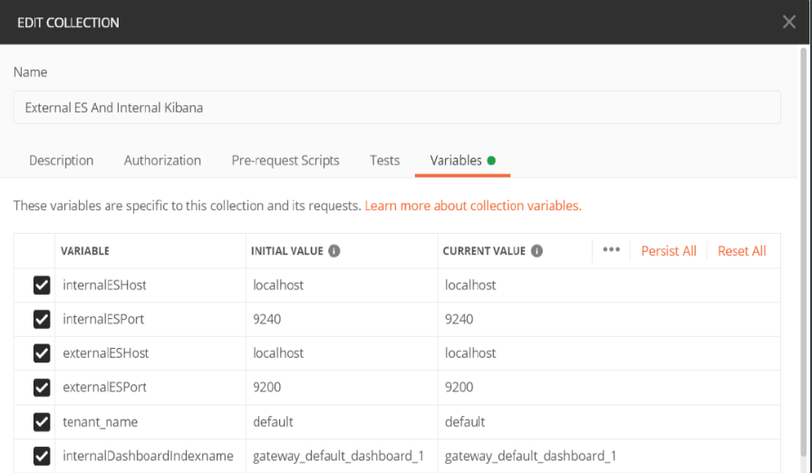

Overview
--------

API Gateway uses Elasticsearch as its primary data store to persist different types of assets such as APIs, Policies, and Applications apart from runtime events and metrics. By default, all assets are stored in the default Elasticsearch. But, you can configure API Gateway to use an external Elasticsearch to store the API Gateway assets. For information about the Elasticsearch version that is compatible with your API Gateway version, see API Gateway, Elasticsearch, Kibana Compatibility Matrix.

Component compatibility matrix
=================================
The table below lists the Elasticsearch versions and corresponding Kibana versions:

| API Gateway version| Compatible Elasticsearch versions                  | Compatible Kibana version |
| ------------------ | -------------------------------------------------- | ------------------------- |
| 10.11              | 7.13.0                                             | 7.13.0                    | 
| 10.7               | 7.7                                                | 7.7                       | 
| 10.5               | 7.2.0                                              | 7.2.0                     | 
| 10.4               | 5.6.4, 2.3.2                                       | 5.6.x, 4.5.x              | 
| 10.3               | 5.6.4, 2.3.2                                       | 5.6.x, 4.5.x              |
| 10.2               | 5.6.4, 2.3.2                                       | 5.6.x, 4.5.x              | 
| 10.1               | 2.3.2                                              | 4.5.x                     | 
| 9.12               | 2.3.2                                              | 4.5.x                     | 

In this tutorial we will see how to connect a Default(Internal) kibana with an external Elasticsearch while the core configuration stored in the API Gateway InternalDataStore and analytic events stored in External ElasticSearch.

Steps to be followed to connect Default(Internal) kibana with ExternalES for analytics, while the core configuration stored in the APIGateway DataStore
==========================================================================================================================================================
1) Set the property apigw.kibana.autostart to false, in uiconfiguration.properties file located at C:\API Gateway instance\profiles\IS_default\apigateway\config\.
2) Open kibana.yml file located at C:\API Gateway instance\profiles\IS_default\apigateway\dashboard\config and specify the external Elasticsearch host and port details, which the Kibana has to connect to, as follows:
   ```
   elasticsearch.hosts: "http://ExternalEsHost:ExternalEsPort"
   ```
3) Remote hosts have to be explicitly allowed in  elasticsearch.yml file of External ElasticSearch using the reindex.remote.whitelist.
   
   Example:
   ```
   reindex.remote.whitelist : ExternalEsHost1:ExternalEsPort1, ExternalEsHost2:ExternalEsPort2
   ``` 
   (Here reindex.remote.whitelist property can be set to list of comma delimited allowed remote host and port combinations.)
4) Start External ES
5) Start APIGateway and InternalDatastore.
6) Import the postman collection "[External ES And Internal Kibana](attachments/External ES And Internal Kibana.postman_collection.json)".
7) Edit internalESHost,internalESPort,externalESHost,externalESPort,tenant_name,
internalDashboardIndexname variables in "External ES And Internal Kibana" postmanCollection as
per your need.
Where internalESHost - Internal ElasticSearch(API Gateway Data Store) Host. internalESPort - Internal ElasticSearch(API Gateway Data Store) Port.
externalESHost - External ElasticSearch Host.
externalESPort - External ElasticSearch Port.
tenant_name - Tenant name.
internalDashboardIndexname - Dashboard index name in Internal ElasticSearch.


8) Run the PostmanCollection.
9) Start Kibana.
10) Create API. Configure the policies. All the log invocation policies should have Elasticsearch as its destination. API Gateway destination must be turned off.

11) Configure Elasticsearch Destination. Configure your external Elasticsearch destination details in the Administration screen and make sure that the index name is "gateway_default_analytics".Refer https://documentation.softwareag.com/webmethods/api_gateway/yai10-7/10-7_API_Gateway_webhelp/index.html#page/api-gateway-integrated-webhelp%2Fgtw_configure_es.html%23 and
https://documentation.softwareag.com/webmethods/api_gateway/yai10-7/10-7_API_Gateway_webhelp/index.html#page/api-gateway-integrated-webhelp%2Fgtw_configure_es_events.html%23
12) Invoke APIs via Elasticsearch REST calls and make sure the events are getting populated in the external Elasticsearch destination
13) Now, invocations should be visible in API Gateway analytics page.
    
Limitations
===========
1)ThreatProtection,Cache statistics dashbord,API usage details-Dashboard will not work
2)Applicationlogs will not work(Check with Arun)
3)Packages dashboard need to confirm with Sadiq
4)Custom dashboard -view will not work.
5)Summary - Package performance will not work.

