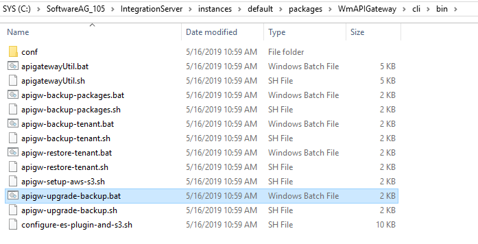
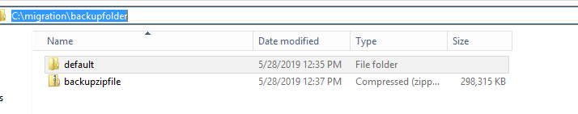
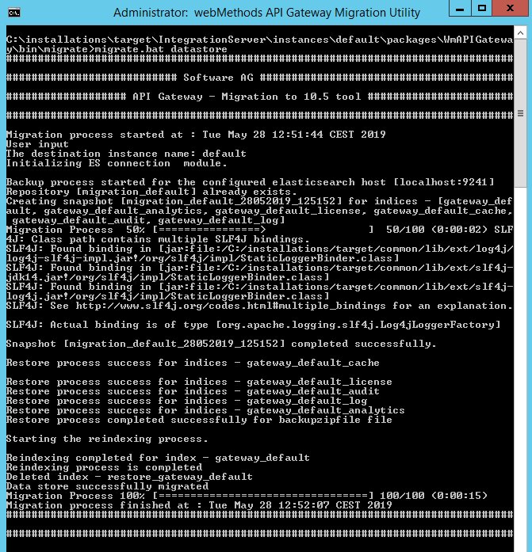
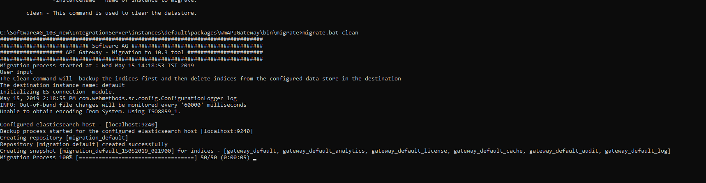

Migrating standalone API Gateway using Backup mode
==================================================

Supported Versions: 10.3 Fix 4 and above

Overview of the tutorial
------------------------

This tutorial explains in detail the steps needed for migrating a **standalone** API Gateway using **Backup** mode.

> **Note:** This tutorial is applicable for on-premise installation only

Required knowledge
------------------

The tutorial assumes that the reader has,

*   a basic knowledge on the API Gateway as a product
*   a basic understanding on Elasticsearch (Internal Data Store)

Why?
----

In earlier versions of API Gateway i.e before 10.3 Fix 4 the migration commands were more complex which involves a multi step process. A lot of manual steps were needed to perform the migration and adding an overhead of restarting API Gateway server and Elasticsearch multiple times. In addition to that the user has to face few more struggles, some of them are, the migration didn't support migration of data from externally configured Elasticsearch and for any troubleshooting, the user has to look out multiple locations for the logs instead of single unified location which is far more easier.

The new migration utility introduced in API Gateway 10.3 Fix 4 will resolve the below issues.

*   The commands are very simple and few
*   Restart of Elasticsearch and API Gateway server is eliminated
*   Migration of Elasticsearch and IS can be done separately
*   Migration of data from externally configured Elasticsearch is supported
*   Logs all the details to a standard file, migrationLog.txt, a single file for all the log data
*   Supports reverting in case of failure in Elasticsearch migration

Prerequisite steps
------------------

Complete the below prerequisites to make you ready to get into the details of the staging and promotion in API Gateway.

*   Install source and target API Gateway instances. The version of target API Gateway should be higher than source API Gateway. Supported source API Gateway versions are 10.1 and above
*   If custom keystore files are used in the source API Gateway installation, copy the files to the same location in the target installation

> **Important Note**: **To avoid known issue in 10.7 migration **
>
> When you migrate from 10.5 to 10.7 version of API Gateway, the fields such as "gatewayEndpoints" and "provider" are not migrated to 10.7 from 10.5.
>
> Before performing the migration, add the two fields in the following location
> <Installation_Location>\IntegrationServer\instances\default\packages
> \WmAPIGateway\bin\migrate\MigrationESHandler.xml
> under the property name 'typesFields' and entry key 'apis'.
>
> This issue will be fixed in the 10.7 fix 4.
>

Details
-------

In this section we will go through the steps for migrating a standalone API Gateway to a higher version using backup mode. The steps are given below.

> **Note:** In APIGateway 10.2 and above the the folder name _**EventDataStore**_ has been changed to _**InternalDataStore**_. Throughout this tutorial we refer source API Gateway installation directory as \<SOURCE\>, target API Gateway installation directory as \<TARGET\> and target elasticsearch is \<TARGET\_ELASTIC\_SEARCH\>

### Step 1: Start source Elasticsearch instance

Go to *\<SOURCE\>\InternalDataStore\config* and configure ***path.repo*** property in ***elasticsearch.yml*** file. path.repo is an elastic search property and it helps us to create a repository in the Elasticsearch where the backup data will be stored. This step would help preparing the \<SOURCE\> Elasticsearch to store the data in this location.


Then start the <SOURCE> Elasticsearch instance.

### Step 3: Take source data backup

Now lets take the backup of source API Gateway data. Go to *\<SOURCE\>\IntegrationServer\instances\default\packages\WmAPIGateway\cli\bin* and run the below command.

***$> apigw-upgrade-backup.bat -backupDestinationDirectory \<path_to_data_store_backup_folder\> -backupFileName \<backup_file_name_without_spaces_for_the_zip\>***



| **Parameter**                | **Description**                                              | **Sample command**                                      |
| :--------------------------- | :----------------------------------------------------------- | :------------------------------------------------------ |
| *backupDestinationDirectory* | Same network. The location where the cumulative backup data will get stored. Make sure the directory is already created before executing the command. | *-backupDestinationDirectory C:\migration\backupFolder* |
| *backupFileName*             | Backup file name. The name of the .zip file that will be created as part of the backup command execution. Make sure the backup file name is specified in lower case | *-backupFileName backupzipFile*                         |

For example,

*$> apigw-upgrade-backup.bat -backupDestinationDirectory C:\migration\backupfolder -backupFileName backupzipfile* 

> **Note**: Make sure the backup destination directory is already created and the backup file name be specified in lower case.


After the command is run successfully, the backup directory would contain the Elasticsearch data folder which is stored with the tenant name (for our use case it is default) and API Gateway configuration data as a zip file (for our use case it is backupzipfile.zip) as seen in the below screenshot. The Elasticsearch data folder is copied from the location we configured in ***Step 1*** by the command.



### Step 4: Start target Elasticsearch instance

- After the backup command is executed and the backup is done, stop the \<SOURCE\> Elasticsearch. 
- Now go to *\<TARGET_ELASTIC_SEARCH\>\config* and configure *path.repo* property in *elasticsearch.yml* file and start the \<TARGET\> Elasticsearch instance.

### Step 5: Create snapshot in target Elasticsearch instance

When the ***\<TARGET_ELASTIC_SEARCH\>*** Elasticsearch is up and running, invoke the below RESP API to create a repository in the \<TARGET\> machine with tenant name.

*PUT /_snapshot/tenant_name*

```json
{
    "type": "fs",
    "settings": {
        "location": <tenant_name>
    }
}
```


For e.g if we want to create a repo for 'default' as tenant name, then the command would be as below.

PUT  /_snapshot/default 

```json
{
    "type": "fs",
    "settings": {
        "location": "default"
    }
}
```

After the REST API invocation, a folder with the tenant name (in our use case it is default) will be created under the path.repo folder.

### Step 6: Copy Elasticsearch backup data to target Elasticsearch snapshot

This is a preparation step for Elasticsearch data migration. Go to ***backupDestinationDirectory/\<tenant_name\>*** directory in ***Step 3*** and copy the contents from Elasticsearch data folder (with tenant name) to the repository folder created in ***Step 5***.

For e.g the below is the Elasticsearch data folder for our use case.


The below is the target repository folder under *path.repo*.


### Step 7: Run migration for Elasticsearch data

Once the above prerequisites are ready we are now ready to run the migration commands to migrate the Elasticsearch data and the API Gateway configurations. In this step we will migrate the Elasticsearch data.

Go to *\<TARGET\>\IntegrationServer\instances\default\packages\WmAPIGateway\bin\migrate* directory and run the below command.

***$> migrate.bat datastore***



After command is run the data store data will be migrated.

### Step 8: Run migration for IS configurations

After successful migration of Elasticsearch data, run API Gateway configurations migration using the below command.

***$> migrate.bat apigateway -srcFile \<backupLoc\> fileName.zip -instanceName \<old instance name\> -newInstanceName \<new instance name\>***

| **Parameter**     | **Description**                                              | **Sample command**                                     |
| :---------------- | :----------------------------------------------------------- | :----------------------------------------------------- |
| *srcFile*         | Provide the .zip file location that were created as part of backup process. This can also be a shared network file. | *-srcFile C:\migration\backupfolder\backupzipfile.zip* |
| *instanceName*    | This is optional parameter. Here we need to pass \<SOURCE\> instance name .If you don't provide any name then 'default' will be assigned. If you want to migrate different instance other than default, please provide its. (To know more about Integration server instances please refer its doc) | *-instanceName default*</br> *instanceName test*       |
| *newInstanceName* | This is optional parameter. Here we need to pass \<TARGET\> instance name .If you don't provide any name then 'default' will be assigned. If you have created a new instance other than default in Integration server and you want to migrate to the new instance then please provide its name for -newInstanceName option | *-newInstanceName default</br> newInstanceName prod*   |

For e.g

*$> migrate.bat apigateway -srcFile C:\migration\backupfolder\backupzipfile.zip -instanceName default -newInstanceName default*


#### File system configurations

The following configurations are persisted in file system and some of them are covered using IS migration. Please verify the correctness of these configurations in the target environment once the above migration procedures are executed. Configurations changes done in elasticsearch.yml, kibana.yml etc are not covered using the migration procedure, can be migrated manually. 

> **Note**: Most of the configurations can be configured using externalized configurations. For information on externalization,  refer **[this](https://tech.forums.softwareag.com/t/starting-api-gateway-using-externalized-configurations/237312)** tech community article.

The configurations are listed below.

| Configuration                      | File name                                                    | File location                                                |
| ---------------------------------- | ------------------------------------------------------------ | ------------------------------------------------------------ |
| Elasticsearch configuration        | elasticsearch.yml                                            | SAGInstallDir/InternalDataStore/config/                      |
| Elasticsearch client configuration | config.properties                                            | SAGInstallDir/IntegrationServer/instances/<br/>instance_name/packages/WmAPIGateway/config/<br/>resources/elasticsearch/ |
| Kibana configuration               | kibana.yml                                                   | SAGInstallDir/profiles/instance_name/<br/>apigateway/dashboard/config/ |
| Master password                    | mpw.dat                                                      | SAGInstallDir/profiles/instance_name/<br/>configuration/security/passman/ |
| UI configurations                  | uiconfiguration.properties                                   | SAGInstallDir/profiles/instance_name/<br/>apigateway/config/ |
| SAML group mapping                 | saml_groups_mapping.xml                                      | SAGInstallDir/IntegrationServer/instances/<br/>instance_name/packages/WmAPIGateway/config/<br/>resources/security/ |
| WebApp settings                    | com.softwareag.catalina.connector.http.pid-apigateway.properties<br/>com.softwareag.catalina.connector.https.pid-apigateway.properties | SAGInstallDir/profiles/instance_name/<br/>configuration/<br/>com.softwareag.platform.config.propsloader/ |

##### Server ports configuration

If the portClusteringEnabled extended setting is set to false, the server ports should be created in each instance by the Administrator.

##### SAML SSO Configuration

Ensure that the following files in SAML SSO configuration (SSO configuration done in API Gateway Admin UI) are accessible to the new instance. If not, manually copy those files to the new instance.

*   IDP metadata 
*   Gateway metadata
*   Keystore

##### Custom ESB packages

Also make sure that all the custom packages are installed and ready in the new instance(s).

### Step 9: Post migration steps

This is a post migration step. Follow the below steps.

*   Shutdown the target Elasticsearch instance
*   Start target API Gateway server
*   You can find the logs  at target directory  _**\<TARGET\>/install/logs/migrationLog.txt**_ 
*   You can find the API Gateway migration reports at  _**\<TARGET\>\\install\\logs\\APIGW\_Migration\_Reports\_<date\_time>**_

### General Migration configurations

API Gateway customers can modify certain parameters for migration based on their requirements by modifying the property file _**migration.properties**_ which is located at _\<TARGET\>\\IntegrationServer\\instances\\default\\packages\\WmAPIGateway\\bin\\migrate_. This property file is instance specific and customers can have different configurations while migrating different instances.

| **Property**                                             | **Description**                                              | **Default value** | **Possible values**                                          |
| -------------------------------------------------------- | ------------------------------------------------------------ | ----------------- | ------------------------------------------------------------ |
| apigateway.migration.srcTenantName                       | By default, the source tenant is assumed as default. But If the source API Gateway has multiple tenants, this property can be used to specify the tenant name from which the data has to be migrated to the target tenant. | default           | Any available tenant in Elasticsearch                        |
| apigateway.migration.batchSize                           | The batch size with which the data is processed. For e.g if size is 100 then by default 100 documents will be processed first. If the network is slow we can decrease this value and if the network is better we can increase this value. | 100               | Appropriate batch size. It depends on the number of documents and the size of the documents in the data store |
| apigateway.migration.logLevel                            | Log level for migration. we can change log level to debug, error etc. | info              | info,debug,error,warn,trace                                  |
| apigateway.migration.reindex.status.check.sleep.interval | Interval configuration in milliseconds. Once the re-indexing process has started from source to target instances, migration process will wake up after every configured sleep interval to check whether the re-indexing is complete. It will check the status of the task id | 5000              | Appropriate sleep interval                                   |

### Recovery

During migration, if there is any problem in the execution or any of the handlers got failed, to make sure that assets are migrated properly, we can clean the target instance once and then re run the migration. This clean command will clean the target data store  (the one configured in the config.properties of target machine) . During this procedure all the indices will be removed and this is a non reversible action. Before cleaning the data we will also take a backup of the existing data (you can also restore it). Once cleaned, we can re-run the migration. Also once you trigger the clean command, this process will wait for 5 seconds and if you wrongly triggered it and you want to kill this process you can do that with in that 5 seconds interval.



### Clean command

> **Note (Before running clean command):** If the \<TARGET\> is 10.5 and the clean command is executed in a cluster, go to \<SOURCE\>\\InternalDataStore\\config and configure path.repo property in elasticsearch.yml file for all the nodes. Make sure that the path.repo is a shared network folder and should be accessible for all the Elasticsearch nodes in the cluster. 

Go to _\<TARGET\>\\IntegrationServer\\instances\\default\\packages\\WmAPIGateway\\bin\\migrate_ and run the below command.

_**$> migrate.bat clean**_

> **Note:** Since this command removes all the assets from data store, make sure that the target data store is properly configured in config.properties which is located at \<TARGET\>\\IntegrationServer\\instances\\default\\packages\\WmAPIGateway\\config\\resources\\elasticsearch.

Troubleshooting
---------------

| **#** | **Issue Description**                                        | **Scenario name**           | **Reason**                                                   | **Remedy**                                                   |
| ----- | ------------------------------------------------------------ | --------------------------- | ------------------------------------------------------------ | ------------------------------------------------------------ |
| 1     | ElasticsearchException[Error while reindexing APIs. Error type - illegal_argument_exception,reason [localhost:1240] not whitelisted in reindex.remote.whitelist] | Direct - Standalone         | Remote re-indexing property missed in target elasticsearch.yml | Add the below property in \<TARGET\> elasticsearch.ymlreindex.remote.whitelist: \<sourcehost\>:\<sourcehttpport\> |
| 2     | Exception thrown during migration operation. Exiting the operation.No Such command - -srcDir | Direct - Standalone         | Wrong command usage                                          | datastore/apigateway argument must be passedmigration.bat apigateway -srcDir C:\SoftwareAG_10.1 -instanceName default -newInstanceName default |
| 3     | Deleting the backup folder before migration... Migration Process 0% [>] 0/100 (0:00:00) java.io.FileNotFoundException: 15:41:13.580 [main] ERROR com.softwareag.apigateway.utility.command.backup.instance.BackupApiGatewayInstance - Error occurred while trying to parse the Manifest file to obtain the version information. java.io.FileNotFoundException:(The system cannot find the file specified) | Backup - Standalone         | Existence of isExtract file due to migration failure of previous steps | Delete the isExtract folder in C:\\<InstallationDir\>\       |
| 4     | elasticsearchclient bean creation exception                  | All                         | Make sure the respective Elasticsearch nodes is running      |                                                              |
| 5     | [2018-12-19T12:34:03,892][WARN ][o.e.r.VerifyNodeRepositoryAction][[SAG-2KXGBH2.eur.ad](http://sag-2kxgbh2.eur.ad/).sag1544697848038] [default] failed to verify repositoryorg.elasticsearch.repositories.RepositoryVerificationException: [default] a file written by master to the store [C:\SoftwareAG_10.3\InternalDataStore\dasoSnap\default] cannot be accessed on the node [{[SAG-2KXGBH2.eur.ad](http://sag-2kxgbh2.eur.ad/).sag1544697848038} {yL84xqhZQSuFfUmj0GrFbQ}{uGv-BmTBT6e8LCpOsxpGOg} {10.60.37.18}{10.60.37.18:9340}]. This might indicate that the store [C:\SoftwareAG_10.3\InternalDataStore\dasoSnap\default] is not shared between this node and the master node or that permissions on the store don't allow reading files written by the master node | Backup Mode - Cluster       | Make sure path.repo is a single common location reachable and accessible by all other nodes | Configure single common shared path in elasticsearch.yml (path.repo) |
| 6     | The system cannot find the path specified                    | All                         | Make sure that the bat from the proper location              | Make sure that you are running the bat from the proper location |
| 7     | 2019-10-16 11:59:36 ERROR ESDataStoreHandler:327 - {"type":"illegal_argument_exception","reason":"Remote responded with a chunk that was too large. Use a smaller batch size.","caused_by":{"type":"content_too_long_exception","reason":"entity content is too long [185463385] for the configured buffer limit [104857600]"}} | All                         | The size of the documents selected for reindexing as per the batch size configuration is large | Try with a smaller batch size number.                        |
| 8     | Error while getting task details for taks id - 6L6RMNEOQF64lQbNeI7J_g:683354. Message - task [6L6RMNEOQF64lQbNeI7J_g:683354] isn't running and hasn't stored its results | All                         | When the space in machine is less than 10% , elasticsearch marks index as readonly hence reindex task fails abruptly | Increase the memory                                          |
| 9     | ERROR ESDataStoreHandler:432 - Error while restoring index - gateway_default_analytics<br/>[java.io](http://java.io/).IOException: listener timeout after waiting for [100000] ms | Backup - Standalone/Cluster | While restoring the elasticsearch data from backup snapshot, the elasticsearch client is timed out due to the time taken to restore the large data in elasticsearch | To avoid this, Please increase value of the below properties accordingly.<br/>First increase read time out, then increase max retry time based on the calculation specified in the comment.<br/>#Read timeout in milli seconds between API Gateway and Event Data Store/Elasticsearch<br/>pg.gateway.elasticsearch.http.socketTimeout=30000<br/>#Time out in milli seconds to wait for retries<br/>#It is advisable to set max retry time for a request to (number of nodes * socketTimeOut )+connectionTimeout<br/>pg.gateway.elasticsearch.http.maxRetryTimeout=300000 |

References
----------

*   [https://www.elastic.co/guide/en/elasticsearch/reference/current/index.html](https://www.elastic.co/guide/en/elasticsearch/reference/current/index.html)
*   [https://www.elastic.co/guide/en/elasticsearch/reference/master/docs-reindex.html](https://www.elastic.co/guide/en/elasticsearch/reference/master/docs-reindex.html)

Learn more
----------

*   For backup and restore refer [http://techcommunity.softwareag.com/pwiki/-/wiki/Main/Back+up+and+restore+of+API+Gateway+assets](http://techcommunity.softwareag.com/pwiki/-/wiki/Main/Back+up+and+restore+of+API+Gateway+assets)
