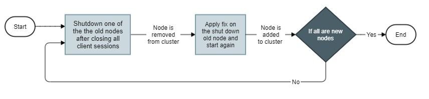
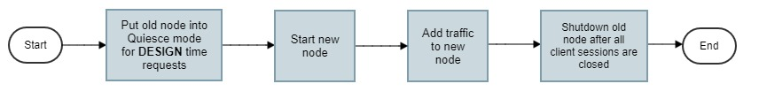

# Upgrading minor versions in zero downtime

Supported versions: 

10.7 or above

## Overview of the tutorial

This tutorial explains in detail the steps needed for upgrading API Gateway in zero downtime for minor versions, i.e. Fix updates, like 10.7 Fix 1 to 10.7 Fix 2. The upgrade details for cluster and standalone deployments are explained in separate sections.

## Required knowledge

The tutorial assumes that the reader has,

*   a basic knowledge on the API Gateway as a product

## Why?

The existing migration approach incurs a downtime while doing upgrade. This approach provides an upgrade process with zero downtime.

## Prerequisite steps

Complete the below prerequisites to make you ready to get into the details of upgrading API Gateway in zero downtime.

*   Old API Gateway instance should be running

## Details

### Upgrade of cluster deployment

Zero downtime upgrade of minor versions in a cluster is a rolling upgrade. Old nodes are brought down and come out of the cluster one by one while new nodes are brought up and added to the cluster one by one. There is no data migration as both the old and new versions would be pointing to the same datastore. In this section we will go through the steps.

The below diagram show the entire workflow for this use case.



The steps are given below.

#### Step 1: Shutdown one of old API Gateway nodes

> **Note**: If all the nodes in the cluster are new nodes, then skip this step as migration is complete.

Shutdown one of the old nodes after all the active client sessions in that node are closed.

Invoke the below REST API to shutdown the old instance(s).

`POST /invoke/wm.server.admin/shutdown`

```json
{
    "bounce": "no",
    "option": "drain",
    "timeout": 10
}
```

The timeout value is depending on the number of active client sessions.

> **Note**: For 10.7 and above use the API Gateway API /rest/apigateway/shutdown to shutdown the API Gateway server.

##### Rollback on error

If the shutdown fails with error, restart all the instances and update the load balancer to route the traffic only to it/them to go back to the original state before migration. Contact Software AG support team for help with all the relevant logs for further analysis.

#### Step 2: Apply fix and start

When the node in Step 1 is shutdown, apply the fix and start again.

> **Note**: For Docker case the fix can't be applied on the old container. Instead a new container from an image already built with the fix is started. Make sure the IS configurations which are not stored in datastore and custom IS packages are pre-configured in the new containers when starting.

Repeat Steps 1 and 2 until all the nodes in the cluster becomes new nodes.

### Upgrade of standalone deployment

API Gateway follows Blue-Green deployment approach to upgrade to newer minor version in zero downtime. In such deployment scenario, old instance will be allowed to run and serve the transactions while the new version of API Gateway is being prepared. There is no data migration as both the old and new versions would be pointing to the same datastore. The new API Gateway version would be started and the old instance is blocked for design time(core) data updates. After that the new node's endpoint is added to the load balancer. At this time the transactions are served by both the old and new versions. Next, all the transactions to the old version is blocked and the logs and events data are migrated to the new version while it is serving the transactions.

In this section we will go through the steps for doing zero downtime upgrade of minor version in a standalone deployment.  The below diagram shows the entire workflow for this use case.



The steps are given below.

#### Step 1: Put old API Gateway instance into Quiesce mode for design time

> **Note**: This operation is performed at old API Gateway instance.

API Gateway data in the datastore is migrated in two phases. In first phase, only the design time data like APIs, Applications, Policies, etc. will be migrated. The runtime data like audit logs, transaction logs, performance metrics, etc. will be migrated in the next phase that is after the runtime transactions to the old instance(s) are stopped. This will be done after the new instance(s) is up and running with the new data and runtime traffic is allowed to it.

Before migrating design time data in the first phase, all the updates to them through UI and REST APIs need to be blocked. This can be achieved by the Quiesce mode capability available in API Gateway.

Invoke the below REST API at old API Gateway instance to put it into Quiesce mode for design time.

`PUT /rest/apigateway/quiescemode`

```json
{
    "enable": true,
    "block": "designtime"
}
```

If the invocation is successful the REST API will return with 200 OK.

```json
{
    "enable": true,
    "block": "designtime",
    "status": "success"
}
```

Now all the design time invocations to the old instance will be blocked and API Gateway will return 503 to the client. Only the below requests will be allowed:

- All GET requests
- /rest/apigateway/quiescemode
- /rest/apigateway/search
- /rest/facade/apigateway/searchApis

##### Quiesce mode for design time operation status

When the Quiesce mode for design time is complete, API Gateway sends out a notification through webhook with the result details if a one is registered. Or you can invoke the below REST API to check for the current status of the operation.

`GET rest/apigateway/quiescemode`

`"status": "success"` means the Quiesce mode for design time is complete.

##### Rollback on error

If the Quiesce mode for design time API invocation fails with an error or the status returned with a failure, stop proceeding with the next steps and disable the Quiesce mode for design time in the old node and bring it back to normal state. Contact Software AG support team for help with all the relevant logs for further analysis.

#### Step 2: Start new API Gateway instance

Install the new API Gateway instance, apply the desired fix and do the below prerequisites.

##### IS/File system configurations and custom packages

As zero downtime upgrade dealt only with the migration of datastore data, the Administrator has to take care of migrating the non datastore configurations such as file system configurations, ports configurations and custom ESB packages to the new API Gateway instance(s) before running the migration of data. For a detailed list of configurations that are to be manually configured by the Administrator, please refer *Backup and Restore* section under *Data Management* chapter in the *API Gateway Configuration Guide*. 

> **Note**: Most of the configurations can be configured using externalized configurations. For information on externalization,  refer **[this](https://tech.forums.softwareag.com/t/starting-api-gateway-using-externalized-configurations/237312)** tech community article.

The configurations are listed below for your convenience.

###### File system configurations

| Configuration                      | File name                                                    | File location                                                |
| ---------------------------------- | ------------------------------------------------------------ | ------------------------------------------------------------ |
| Elasticsearch configuration        | elasticsearch.yml                                            | SAGInstallDir/InternalDataStore/config/                      |
| Elasticsearch client configuration | config.properties                                            | SAGInstallDir/IntegrationServer/instances/<br/>instance_name/packages/WmAPIGateway/config/<br/>resources/elasticsearch/ |
| Kibana configuration               | kibana.yml                                                   | SAGInstallDir/profiles/instance_name/<br/>apigateway/dashboard/config/ |
| Master password                    | mpw.dat                                                      | SAGInstallDir/profiles/instance_name/<br/>configuration/security/passman/ |
| UI configurations                  | uiconfiguration.properties                                   | SAGInstallDir/profiles/instance_name/<br/>apigateway/config/ |
| SAML group mapping                 | saml_groups_mapping.xml                                      | SAGInstallDir/IntegrationServer/instances/<br/>instance_name/packages/WmAPIGateway/config/<br/>resources/security/ |
| WebApp settings                    | com.softwareag.catalina.connector.http.pid-apigateway.properties<br/>com.softwareag.catalina.connector.https.pid-apigateway.properties | SAGInstallDir/profiles/instance_name/<br/>configuration/<br/>com.softwareag.platform.config.propsloader/ |

###### Server ports configuration

If the portClusteringEnabled extended setting is set to false, the server ports should be created in each instance by the Administrator.

###### Custom ESB packages

Also make sure that all the custom packages are installed and ready in the new instance(s).

Now start the new API Gateway instance by connecting it to the old datastore as external.

#### Step 3: Add traffic to new API Gateway instance

After the new API Gateway instance is started, now the runtime traffic can be allowed to it. Adding traffic to the new instance depends on the deployment model.

For e.g for on-premise and docker deployment, it would be an update to load balancer for adding the new endpoints. For kubernetes deployment, it would be a label change in Service resources.

#### Step 4: Shutdown old API Gateway instance

When the new instance is added to the load balancer, shutdown the old instance after all the active client sessions in that node are closed. By doing so, it won't send any metrics to any configured destinations like API Portal, external Elasticsearch, etc. The new instance is now receiving the runtime transactions. You can probably remove the old instance endpoint from the load balancer.

Invoke the below REST API to shutdown the old instance(s).

`POST /invoke/wm.server.admin/shutdown`

```json
{
    "bounce": "no",
    "option": "drain",
    "timeout": 10
}
```

The timeout value is depending on the number of active client sessions.

> **Note**: For 10.7 and above use the API Gateway API /rest/apigateway/shutdown to shutdown the API Gateway server.

## Troubleshooting

For seeing the detailed logs during the upgrade process, enable the debug logs for these logging facilities 0300 Gateway Commons and 0205 MEN - Events.