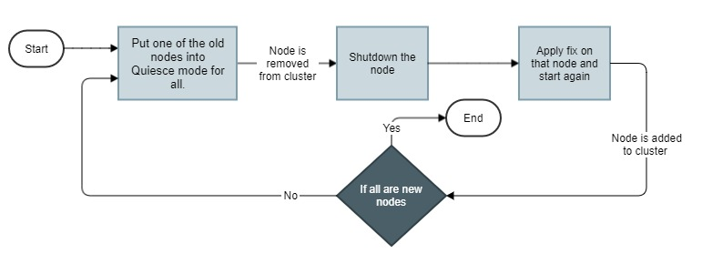

# Zero downtime upgrade of minor versions for cluster

Supported paths: 

10.5 Fix 9 to 10.7 or above

## Overview of the tutorial

This tutorial explains in detail the steps needed for upgrading API Gateway in zero downtime for minor versions in a cluster deployment.

## Required knowledge

The tutorial assumes that the reader has,

*   a basic knowledge on the API Gateway as a product
*   a basic understanding on Elasticsearch (Internal Data Store)

## Why?

The existing migration approach incurs a downtime while doing upgrade. This approach provides an upgrade process with zero downtime.

## Prerequisite steps

Complete the below prerequisites to make you ready to get into the details of the staging and promotion in API Gateway.

*   Old API Gateway instance should be running
*   Create a quiesce port in old API Gateway instance. A sample is given below in the steps.

## Details

Zero downtime upgrade of minor versions in a cluster is a rolling upgrade. Old nodes are brought down and come out of the cluster one by one while new nodes are brought up and added to the cluster one by one.

In this section we will go through the steps for doing zero downtime upgrade of API Gateway.  The below diagram show the entire workflow for this use case.



The steps are given below.

### Step 1: Put one old API Gateway node into Quiesce mode for all

> **Note**: If all the nodes in the cluster are new nodes, then skip this step as migration is complete.

Put one of the old nodes into Quiesce mode for all so that ay ongoing requests in that instance can be allowed to complete their transactions and all the in-memory data like performance metrics, license metrics and subscription quota would be stored in the datastore before the instance is shutdown for applying fix.

#### Prerequisite

Before invoking Quiesce mode for all, as a prerequisite, Quiesce port should be created and enabled in old API Gateway. Invoke the below APIs to create and enable the Quiesce port.

Invoke the below API to create the port. In this example we used 4444 as the port number.

`POST /rest/apigateway/ports`

```
{
    "factoryKey": "webMethods/HTTP",
    "pkg": "WmRoot",
    "port": "4444",
    "portAlias": "QuiescePort"
}
```

Invoke the below API to enable the port.

`PUT rest/apigateway/ports/enable`

```
{
    "listenerKey": "HTTPListener@4444",
    "pkg": "WmRoot",
    "requestServiceStatus": ""
}
```

Invoke the below API to set the Quiesce port. Given the same portAlias value used in the port creation API.

`PUT invoke/wm.server.quiesce/setQuiescePort`

```
{
    "portAlias": "QuiescePort"
}
```

Now the Quiesce port is created and enabled.

#### Enabling Quiesce mode for all

Invoke the below REST API to put the old instance(s) to Quiesce mode for all.

`PUT /rest/apigateway/quiescemode`

```json
{
    "block": "all",
    "flush": [
        "license_metrics",
        "performance_metrics",
        "subscription_quota"
    ],
    "enable": true
}
```

#### Quiesce mode for all operation status

Since this is a long operation, the REST API will initiate the action and return with 200 OK, if the invocation is successful.

When the Quiesce mode for all is complete, API Gateway sends out a notification through webhook with the result details if a one is registered. Suppose if you are interested in retrieving the status through API, invoke the below REST API through **Quiesce port** to check if the Quiesce mode for all is completed.

`GET /rest/apigateway/health`

If status code returned is 200 OK, that means the Quiesce mode for all is still in progress. When the request started returning anything other that 200 or no http response, then it can be considered that Quiesce mode for all is completed successfully.

#### Rollback on error

If the Quiesce mode for all API invocation fails with an error or the status returned with a failure, stop proceeding with the next steps and disable the Quiesce mode for design time in all the nodes and bring them back to normal state. If the instances were already entered into Quiesce mode, restart all the instances and update the load balancer to route the traffic only to it/them to go back to the original state before migration. Contact Software AG support team for help with all the relevant logs for further analysis.

### Step 2: Shutdown old API Gateway instance

When Quiesce mode for all is completed on that node in Step 1, shutdown it.

### Step 3: Apply fix and start

When the node in Step 2 is entered in to Quiesce mode for all, shutdown it, apply the fix and start again.

> **Note**: For Docker case the fix can't be applied on the old container. Instead a new container from an image already built with the fix is started. Make sure the IS configurations which are not stored in data store and custom IS packages are pre-configured in the new containers when starting.

Repeat Steps 1, 2 and 3 until all the nodes in the cluster becomes new nodes.

## Learn more

- Refer **[this](../Zero%20downtime%20upgrade%20capabilities/)** for understanding the capabilities of zero downtime upgrade process
