Variables usage via request and response transformation policies and other policies in API Gateway
==================================================================================================

Authors: Chandrasekaran, Vallab (vac@softwareag.com)

Supported Versions: 10.7 and above (For versions 10.3 and 10.5, **[refer this...](http://techcommunity.softwareag.com/pwiki/-/wiki/Main/Request%20and%20Response%20Transformation%20policies%20in%20API%20Gateway)**)

---------------------------------------------------------------------------------------------------------------------------------------------------------------------------------

Overview of the tutorial
========================

Right from the initial versions of API Gateway, there are options like Invoke webmethods IS policy in API Gateway that helps the API Provider to plugin custom logics, such as transformation of request and response contents, in the mediation flow of an API.  However the transformation policies introduced in version 10.2 provide a better and easy configuration of transformations based on conditions to a greater extent. The Provider does't need to create an IS service explicitly, instead they can use the simple UI configurations in the transformation policies to achieve the same use cases. Using the concept called "variables", a provider can access and evaluate (a condition) and/or modify the contents of request or response like headers, query parameters, path parameters, HTTP method, status code, status message and payload etc. In 10.7, usage of these "variables" are enhanced further and extended to be used across all other policy actions as well.

Required knowledge
==================

The reader is expected to have a basic understanding of API Gateway and policy enforcement.

Why?
====

API Gateway forwards the incoming requests from the client to the native service, and forwards the response from the native service back to the client. Now if the API Provider wants to modify the request before forwarding the request to native service, they can make use of Request Transformation policy. Similarly Response Transformation policy can be used to modify the response before forwarding it to the client.   
  
For example, consider an usecase like, the native service wants to identify all incoming requests via the API Gateway. For that usecase, the API provider can simply configure the Request Transformation policy to add a header which is uniquely identifiable by the native server and using that the native server identifies the requests sent via API Gateway. 

What are Variables and what's new in 10.7
-----------------------------------------

Right from the introduction of the request and response transformation policies (in 10.2), these policies uses a concept called "Variables". Variables are nothing but a defined set of syntaxes that can be used to access or modify the contents of request or response (such as headers, payload, etc). For example, we can use the syntax ${request.headers.xyz} to access the value of the request header "xyz" or modify it's value. 

In 10.7, usage of these variables are enhanced further. Following are the enhancements supported from 10.7

1.  Until 10.5, variables are supported only in request and response transformation policies and custom extension policy. Variables can now be accessed across all stages and most of the policy actions and policy parameters support this. 
2.  Simple aliases can also be accessed via variables. You can now access the value of the simple aliases in any policy action using the variables syntax.
3.  System and custom variables (supported in earlier versions via Invoke IS Service and known as context variables) can now be defined or accessed in any policy action.
    1.  System variables (also called as system context variables) are variables which can be used to access the values computed  by API Gateway during the runtime. The values of these variables cannot be modified.  
        For example, you can access the value of the IP address from which the request is received using the syntax ${inboundIP} but you are not allowed to modify the value of this. 
    2.  Custom variables are the set of variables which are defined by API provider at policy level and can be accessed at other policies downstream.  
        Custom variables can be configured using the "Custom Variables" option in custom extension policy. 
4.  Many new variables are added that allow access to more information at policy level.
5.  Adding custom fields to transactional events.   
    Adding custom fields to the transactional events are supported from 10.3 via Invoke IS Service policy. Now you have an option to do that without having to write an IS Service for this purpose.
6.  Modify the request/response payload via request/response transformation policy respectively.
7.  Access to request variables in response and error stage. From 10.7, you can use the ${request....} syntax to access the request variables in response and error stage.

We will see about these enhancements in detail in below sections. 

Prerequisite steps
==================

*   Install advanced edition of API Gateway 10.7 or later

Details
=======

Variables
---------

Variables are nothing but a defined set of syntaxes that can be used to access or modify the contents of request or response (such as headers, payload, etc). For example, we can use the syntax ${request.headers.xyz} to access the value of the request header "xyz" or modify it's value. 

Let's define the syntaxes and guidelines for the usage of variables. We will use these syntaxes in the next sections where will try to achieve some usecases using policies like Transformation policy. 

### Variable types

We can broadly classify the variables under the below types.

1.  **Request variables -** for accessing/modifying the value of the request content. For example, access a particular header.
2.  **Response variables** - for accessing/modifying the value of the response content. For example, modify the status code before sending to client.
3.  **System variables -** System variables (also called as system context variables) are variables which can be used to access the values computed  by API Gateway during the runtime.  
    For example, you can access the value of the IP address from which the request is received using the syntax ${inboundIP} but you are not allowed to modify the value of this. 
4.  **Custom variables** \- An API provider can define any custom variable with their preferred name and assign a value to the variable using custom extension policy.  
    The value of those custom variables can be accessed at other policies downstream using the variables syntax.

### Request and response variables - syntax

The request variables and response variables generally can be accessed using one of the below syntax formats

*   ${paramStage.paramType.name}
    *   For example, ${request.headers.xyz} is used to access the request header "xyz"
*   ${paramStage.paramType.queryType\[query\]} 
    *   For example, ${response.payload.jsonPath\[$.cardDetails.number\]} is used to apply the jsonPath "$.cardDetails.number" on response payload.
*   ${paramStage.paramType}
    *   For example, ${response.statusCode} to access the response status code.

The below table provides the definition and possible values for the keywords like paramStage, paramType and queryType.

|**Keyword**|         **Usage**                 |
| --------- | --------------------------------- |
|paramStage |Defines the stage which we are referring. Possible values are,  1. request  2. response|
|paramType  |Defines the specific parameter of the request/response whose value we are accessing or transforming.   Possible values are,  1.  payload  2.  headers  3.  query (applicable only for REST) 4.  path (applicable only for REST) 5.  httpMethod (applicable only for REST) 6.  statusCode  7.  statusMessage 8.  authorization 9.  application  10.  correlationID|
|queryType  |Defines the query type that can be applied over elements like payload. Possible values are,  1.  xpath  2.  jsonPath  3.  regex|

#### Request/response variables - combinations:

> **Note**: The actual syntax encapsulates the paramStage, paramType and paramName listed below within ${ and }. For example, the equivalent variable syntax for row 1 should be request.headers.HEADER\_NAME

> **Note**: If value of paramStage or paramType is empty for a row in below table, it means the value of the previous row(s) is carried over to this row. 
For example, the equivalent variables syntax for row 2 should be ${request.query.QUERY\_NAME}

|**paramStage**|**paramType**|**parameter name**|**Comments**|
| ------------ | ----------- | ---------------- | ---------- |
| request      | headers     | HEADER\_NAME     |            |
|              | query       | QUERY\_NAME      | applicable only for REST |
|              | path        | \-               | Full path param. applicable only for REST |
|              |             | PATH\_PARAM\_NAME| Retrieves path param value at runtime for given name.   applicable only for REST |
|              |             | regex\[REGEX\_EXPRESSION\]| applicable only for REST |
|              | httpMethod  | \-               | applicable only for REST |
|              | payload     |xpath\[EXPRESSION\]||
|              |             |jsonPath\[EXPRESSION\]||
|              |             |regex\[EXPRESSION\]||
|              |authorization|clientId||
|              |             |issuer||
|              |             |userName||
|              |             |authHeader|Used for obtaining the value of authorizaion header.   If the authorization header has bearer tokens (OAuth, OpenID, or JWT), this variable returns empty.  Use ${request.authorization.incomingToken} syntax for bearer tokens.|
|              |             |apiKey||
|              |             |incomingToken||
|              |             |audience |Introduced to hold the audience value found after the authorization.  In case of JWT/OpenID/OAuth2 this would be the "aud" claim|
|              |             |claims.CLAIM\_NAME||
|              |correlationID| \-      ||
|              |application  |id       ||
|              |             |name     ||
|              |             |version  ||
|              |             |claims.CLAIM\_NAME ||
|              |             |description ||
|              |             |partnerID ||
|              |             |headers.HEADER\_NAME ||
|              |             |hostname\[INDEX\] |ex: ${request.application.hostname\[0\]}|
|              |             |payloadIdentifier\[INDEX\]|ex: ${request.application.payloadIdentifier\[0\]}|
|              |             |team\[INDEX\]|ex: ${request.application.team\[0\]}|
|              |             |token\[INDEX\]|ex: ${request.application.token\[0\]}|
|              |             |username\[INDEX\]|ex: ${request.application.username\[0\]}|
|              |             |wssUsername\[INDEX\]ex: ${request.application.wssUsername\[0\]}|
|response      |header       |HEADER\_NAME||
|              |statusCode   |\-||
|              |statusMessage   |\-||
|              | payload     |xpath\[EXPRESSION\]||
|              |             |jsonPath\[EXPRESSION\]||
|              |             |regex\[EXPRESSION\]||
 
### System variables 

System variables are variables which can be used to access the values computed by API Gateway during the runtime  
The syntax for system variables is _**${variableName}.**_ 

> **Note**: As we will see in next section, syntax for custom variables is also same as the system variables. However the difference is, the values of the system variables cannot be modified whereas values of custom variables can be set by API provider. In other words, system variables syntax are reserved and those syntax cannot be used as custom variables for setting/modifying the value.

#### Supported system variables

|**Syntax**|**Variable Definition**|**Comments**|
| -------- | --------------------- | ---------- |
|${user}                |User who sent the request||
|${inboundHttpMethod}   |HTTP method used by the client to send the request||
|${routingMethod}       |The HTTP method used by the API Gateway in the routing policy to send the request to native API.|Same as ${request.httpMethod}|
|${inboundContentType}  |Content type header from the client request||
|${inboundAccept}       |Accept header from the client request||
|${inboundProtocol}     |Protocol of the client request||
|${inboundRequestURI}   | A partial reference of the request URI from client where the protocol, host and port are not part of the value (Supported for HTTP and HTTPS) | For example, if incoming request URI is **http://host:port/gateway/cars?vin=1234,** then ${inboundRequestURI} will return /gateway/cars?vin=1234 |
|${inboundIP}           |IP Address of the client sending the request||
|${gatewayHostname}     |Host name of the API Gateway server processing the request||
|${gatewayIP}           |IP address of the API Gateway server processing the request||
|${operationName}       |API operation selected from the request|Applicable only for SOAP API|
|${nativeEndpoint}      |Native service endpoint for this request|Value is populated only after routing policy is executed|
|${soapHeaders\[HEADER\_NAME\]} |Soap headers in a SOAP request||
|${apiId}               |Unique identifier of the API selected from the request||
|${packageId}           |Unique identifier of the package selected from the request||
|${planId}              |Unique identifier of the plan selected from the request||
|${providerTime}        |The time taken in milliseconds between the request sent to native server and response received from native server for this transaction||
|${apiName}             |Name of the API selected from the request|Available from 10.7 fix 5|

### Custom variables

Custom variables are variables which can be defined by an API provider with their preferred name and a value using "custom variables" option in custom extension policy. The value of those custom variables defined at any stage can be accessed at other policies downstream (in current stage and stages after) using the variables syntax.

#### Defining a custom variable

1.  To define a custom variable, add a custom extension policy in any stage. 
2.  Select the Action as "Custom variable" 
3.  Enter the name of the custom variable in "Variable" field and value in "Value" field.  
    For example in the snapshot given below, we have added variable as "myCustomVar1" and value as "val1"  
    You can assign some other variable (request/response/system/custom variables or combinations of these) to the value field. 
4.  Click on Add to add the variable. It will be listed in the table below.   
    You can add more than one custom variables using the "Add" button and they will be added to the table.
5.  Click save.  
    Your custom variable is defined and can be accessed in all policies that execute after this policy (in this stage as well as stages that come after).

> **Note** : You can use multiple custom extension policies if needed. You can also define conditions in the policy to set the custom variables to some value only if the condition matches.

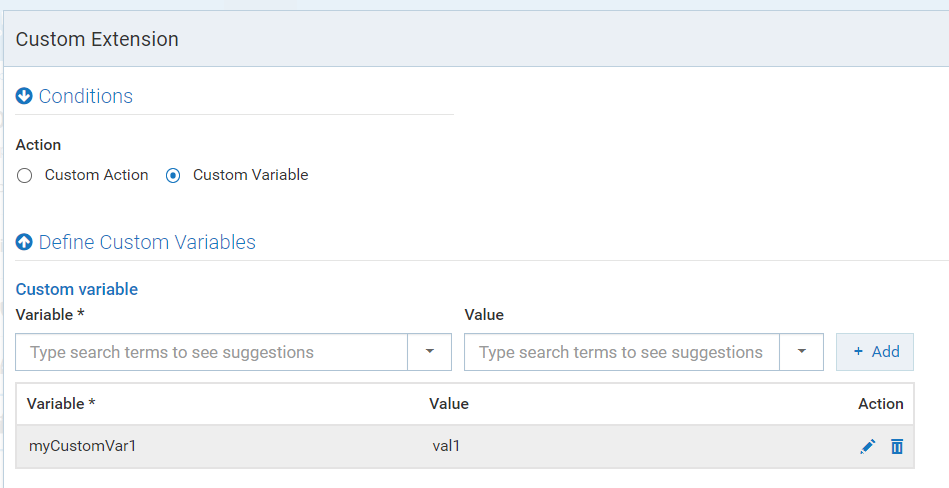

#### Accessing a custom variable

The syntax for accessing custom variables is similar to system variables _**${variableName}**_

The custom variable defined using a custom extension policy can be accessed in all policies that execute after that custom extension policy (in that stage as well as stages that come after).  
  
Let us see an example to use the custom variable defined in previous step "myCustomVar1" (in custom extension policy in IAM stage) in a Data Masking policy in Request Processing stage.

1.  Add a Data Maksing policy in Request Processing stage.
2.  Select the masking type (say JSON Path) and click on "Add Masking Criteria".
3.  Enter the jsonpath to select the element which you want to mask in the "Query Expression".  
    In this example, I have given "$.cardDetails.number" which will select credit card number from credit card details.
4.  Enter the "mask value" as the custom variable we defined in previous stage and click save.
5.  In runtime, the credit card number will be masked with the value of the custom variable defined in previous step.

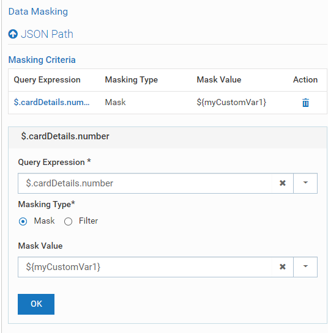

> **Note**: Since syntax for custom variables is also same as the system variables and since the values of the system variables cannot be modified, you cannot use the variable names which are reserved for the system variables when defining a custom variable using custom extension policy.

### Modifiable system variables

Apart from the system variables (read-only) and custom variables (read and write possible) which we have seen in previous sections, there are 3 system-variables which are modifiable.  These variables are similar to system variables in the sense that their variable names are already reserved by API Gateway, but API Gateway allows you to configure their values using custom extension policy.

#### 1) customTransactionFields

API Gateway provides you an option to set custom fields to the transactional events generated for this request.  
To set the custom fields, you can configure the custom variable _**"customTransactionFields.FIELD\_NAME"**_ in Custom Extension policy as shown below.  
You can configure the value of the custom field as some value or refer some other variable which will be resolved at runtime. 

For example, see the below snapshot where we have configured 2 custom fields "myCustomField1" as "myVal1" and "myCustomField2" as another variable to evaluate some header.

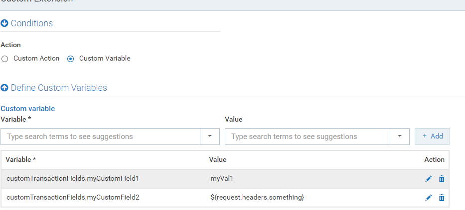

**Syntax for accessing:**   
The below syntax can be used for accessing the field name set via customTransactionFields variable in some other policy (if needed).
${customTransactionFields.FIELD\_NAME}

#### 2) xpathNamespaces

API Gateway provides you an option to define the namespace prefix-uri key value pairs using custom variables option in custom extension policy.  The prefix defined here will be automatically used when resolving a prefix while evaluating the xpath of an variable.  
  
For example, define the prefix "ns1" in a custom extension → custom variable as _**xpathNamespaces.ns1**_ and value as _**http://myURI**_.  Now when, some variable syntax like ${request.payload.xpath\[//ns1:emp/ns1:empName\]} is used in some other policy action downstream, the prefix ns1 will be evaluated using the value configured _**http://myURI**_ automatically.

#### 3) dynamicEndpoint

API Gateway supports the _**dynamicEndpoint**_ variable to access/modify/add the value for "ROUTING\_ENDPOINT"context variable which is exposed via ctxVar Invoke IS service.   The value of this variable is used to replace the ${sys:dyn-Endpoint} in Dynamic Routing policy when "Route Using" is selected as "context".  
  
You can set the value for this variable via "Custom Extension → Custom Variables" option as _**"dynamicEndpoint",**_ or continue to use the ROUTING\_ENDPOINT context variable via Invoke IS Service. 

> **Note 1:** This is available from 10.7 fix 5  
  
> **Note 2:** In future versions, Dynamic Routing policy will be removed and the configurations will be moved under "Conditional Routing" policy as Conditional Routing policy can solve the usecases offered by Dynamic Routing.  Even from 10.7, you can start using conditional routing policy for dynamic routing usecases.    *   For "Route using → header", select the conditon in conditional routing as  ${request.headers.HEADER\_NAME}  equals "someValue or someVariable"    *   For "Route using → context", select the conditon in condtional routing as ${dynamicEndpoint} equals "someValue or someVariable"

### Accessing simple aliases via Variables syntax

Until 10.7, simple aliases can be used in few policies like routing policies. From 10.7, you can access the simple aliases also using the variables syntax. Since most of the policy parameters and policy actions support variables syntax, you can use the simple alias using variables syntax in any of those policy actions.

The syntax for accessing simple alias is same as previous versions and similar to system and custom variables.  
_**Syntax: ${simpleAliasName}**_

> **Simple aliases, System & custom variables - priority**:   Since simple aliases, system variables and custom variables have the same syntax, following is the priority order in which a variable syntax is resolved.   1. A syntax like ${someVariable} is resolved against system variables available.   2. If no matching system variable found, then it is resolved against the custom variables configured for that API   3. If no matching custom variable found, then it is resolved against the simple aliases configured in API Gateway   4. If no simple alias found, empty value "" is returned.    So, if a custom variable is configured with same name as simple alias, the custom variable value will be used for that API execution when resolving the variable syntax.

Transformation Use cases 
-------------------------

The following sections explain the use cases of transformation policies in detail.

### Use case 1: Request Transformation

The _Request Transformation_ policy can be used to modify the contents of an incoming request such as headers, payload, query parameters, path parameters, HTTP method using the configurations given by the API Provider. The below diagram represents the flow of "Request Transformation" policy usage for transforming the request contents. 

**Design time flow**

*   The API Provider configures the "Request Transformation" policy in Request processing stage of API Gateway. The provider configures details about when and how to transform contents such as headers, query parameters, path parameters, payload, HTTP method.

**Run time flow**

*   The Client sends the request to API Gateway
*   API Gateway executes the transformations configured by the API Provider, and transform the incoming request
*   API Gateway sends the transformed request to the native service
*   Native server processes the transformed request and sends the response to API Gateway
*   API Gateway forwards the response to client

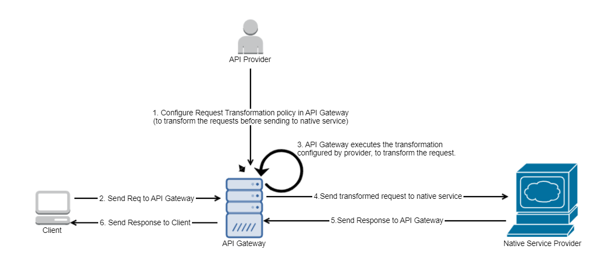

### Use case 2: Response Transformation

The "Response Transformation" policy can be used to modify the contents of an outgoing response such as headers, payload, status code, status message using the configurations given by the API Provider. The below diagram represents the flow of "Response Transformation" policy usage for transforming the response contents. 

**Design time flow**

*   The API Provider configures the "Response Transformation" policy in Response processing stage of API Gateway. The provider configures details about when and how to transform contents such as headers, status-code, status-message, payload.

**Run time flow**

*   The Client sends the request to API Gateway
*   API Gateway forwards the request to native service
*   Native service processes the request and sends response to API Gateway
*   API Gateway executes the transformations configured by the API Provider, and transform the response
*   API Gateway sends the transformed response to the client

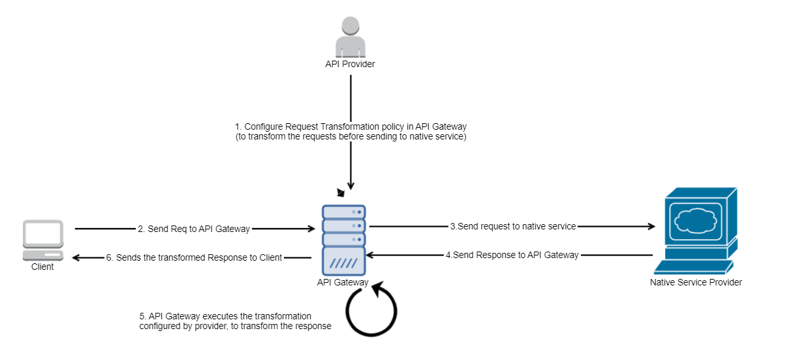

Configuring Transformation policies
-----------------------------------

The request and response transformation policies contain 3 sections at the top level.

1.  Condition
2.  Transformation Configuration
3.  Transformation Metadata

  
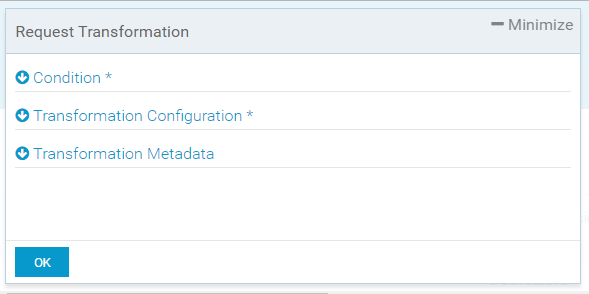

### Condition

The condition parameter provides you option to execute the transformation when configured conditions evaluate to true. The conditions could be used to evaluate the values of the request/response variables (such as header, query parameters, path parameters, HTTP method, payload, status code, status message, authorization, application), system variables or custom variables. The condition parameter contains the following configurations.

1.  Choose whether to evaluate the conditions using AND operator or OR operator.  
    If AND is chosen, the transformation (configured in Transformation Configuration) is executed only when all conditions evaluate to True.  
    If OR is chosen, the transformation (configured in Transformation Configuration) is executed when at least one of the conditions evaluate to True.  
      
    
2.  "Add Condition" button which allows you to configure the conditions. 

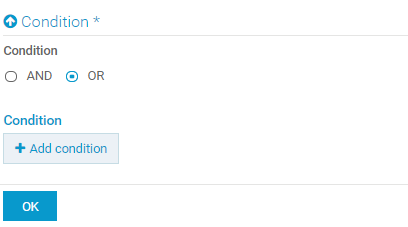
  

When you click on "Add Condition", you can configure the conditions using the following parameters.

#### Variable

Configure the variable for which the condition is evaluated.    
Posisble options - request variables, response variables, system variables or custom variables.  
For example, ${request.path}, ${response.statusCode}, ${request.query.var1}, ${inboundIP}, ${someCustomVariable} are all valid candidates.

#### Operator

Configure the condition operator.  
Possible values - "Equals", "Equals Ignore Case", "Not Equals", "Not equals ignore case", "Contains", "Exists", "Range", "Greater than", "Lesser than".   
"Not contains", "Not exists" are also available from 10.7 fix 5

#### Value

The value with which the variable is evaluated using the conditional operator. (Note: Value field is not needed if "Exists" or "Not exists" is selected as operator)  
Posisble options - request variables, response variables, system variables or custom variables, or just a plain value.  
For example, just enter the plain value directly. eg: application/json. 

  
Once you click OK, the configured conditions are added to the table as shown in image below.

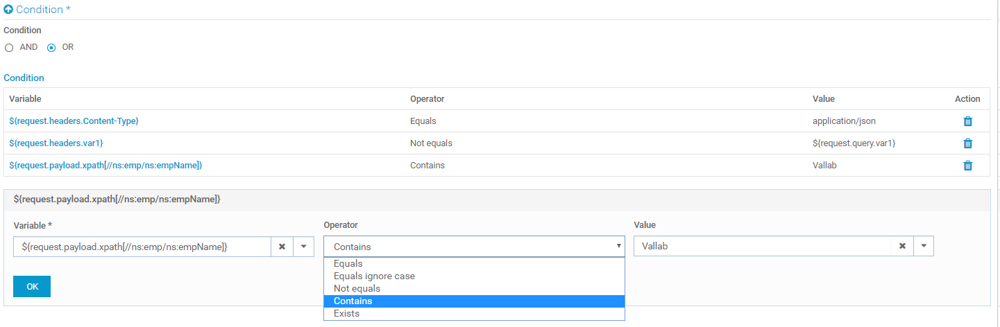

In the screenshot above, three conditions are configured with OR operator. 

1.  The first condition checks if "Content-Type" header value is equal to "application/json"
2.  The second condition checks if the value of header named "var1" and query parameter named "var1" are not equal
3.  The third condition checks that, if the configured value ("Vallab") is the substring of the empName found in the payload after applying the xpath "//ns:emp/ns:empName" to the payload. For example, if "empName" returns "Vallab Chandrasekaran", the condition evaluates to True as "Vallab" is a substring of the value of empName

### Transformation Configuration

The transformation configuration contains the following sub-configurations. 

#### Header/Query/Path transformation

In this section, let us see how to do header, query parameters and path parameter transformation (adding a header or query parameter, modifying the value of a header or query or path parameter, removing a header or query or path parameter) using Transformation policy.

Applicable Types : REST  
Applicable Stage : Request Processing

The child parameters of this configuration are, 

##### Add/Modify

This parameter is used to add or modify one or more header, query and path parameters.  
The child parameters are,

1.  **Variable**
    The variable which needs to be transformed.  
    Applicable syntaxes are below (applicable paramType is only headers/query/path as we are transforming one or more of these.)  
    *   ${paramStage.paramType.paramName} - applicable for header/query/path  
        **Example:** ${request.headers.Content-Type}
    *   ${paramStage.paramType} - applicable only for path.  
        **Example:** ${request.path}  
          
        
2.  **Value**
     The value which needs to be assigned to the variable configured. Any variables syntax or any plain value can be configured.  
    For example,
    1.  Just enter the plain value directly. eg: application/json  (or)
    2.  ${someCustomVariable}

##### Remove

This parameter is used to remove one or more header and query parameters.  
The applicable syntax is ${paramStage.paramType.paramName}.  
  
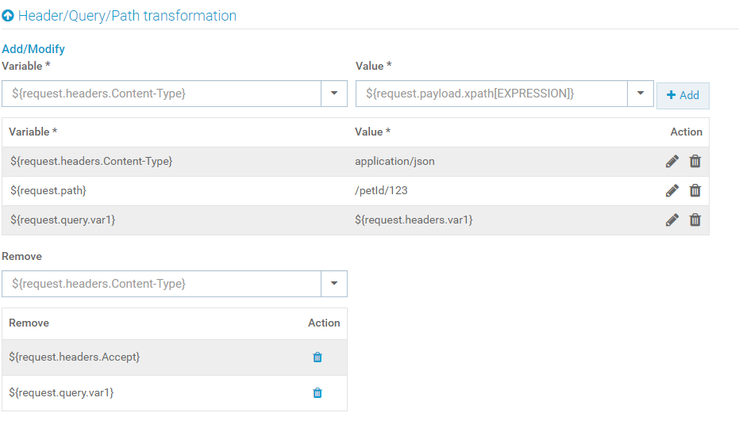
In above image, you could see how to add/modify/remove headers, query, path parameters.

##### Path Transformation - syntaxes and examples

Path transformation can be configured using "Header/Query/Path Transformation" parameter as shown in above section.   
  
Path transformation can be done in many ways using the below syntaxes.

1.  Modify the entire path and set an absolute value.  
    **Example:** ${request.path} **\=** "/name/sekar/age/27"  
      
    
2.  Replace a substring of the path with another value using the path parameter configured in API Gateway.  
    
    For example, if API Gateway "Resources and Methods" is configured with a resource as _"/pet/{petId}"_, and if the path transformation is configured as _${request.path.petId} = "1234"_   
    In the above example, if the incoming path is _"/pet/XYZ"_, it will be modified as _"/pet/1234"_**.**  
      
    
3.  Replace a substring of the path with another value using the exact match  
    **Example:** ${[request.path.name](http://request.path.name)} **\=** "firstName"   
    Above example replaces /name in path with /firstName  
    
4.  Modify the entire path by querying payload using xpath/jsonPath/regEx.   
    **Example:** ${request.path} **\=** ${request.payload.xpath\[//ns:emp/ns:empName\]}  
      
    
5.  Applying regular expression over path.   
    **Example:** ${request.path.regex\[/name/(.)\*?/\]} **\=** "/name/vallab/"  
    Above example replaces "/name/\*\*\*/" with "/name/vallab/"  
      
    
6.  Appending a substring to existing path.  
    **Example:** ${request.path} **\=** ${request.path}/age/27  
    Above example appends '/age/27' to the existing path.

#### **Header transformation** 

In this section, let us see how to do header transformation (adding a header, modifying the value of a header, removing a header) using Transformation policy.

Applicable Types and Stage: Applicable for SOAP (for both Request & Response Processing stages) and REST (only for Response Processing stage).

The syntaxes are similar to "Header/Query/Path Transformation" section, but only "headers" is supported for the left hand side.

#### **Method Transformation**

In this section, let us see how to do HTTP method transformation (modifying the value of HTTP Method) using Transformation policy.

Applicable Types : REST  
Applicable Stage : Request Processing

This parameter is used to transform the HTTP Method of the request. Supported values are CUSTOM, GET, POST, PUT and DELETE.  
If CUSTOM is selected, the HTTP method from the incoming request is retained.  
If any other values are selected, the selected value is set as HTTP Method in the outgoing request to the native service.

#### **Status Transformation**

In this section, let us see how to do Status transformation (modifying the value of status code and/or status message) using Transformation policy.

Applicable Types : SOAP/REST  
Applicable Stage : Response Processing

This section is used for transforming status code and status message. The child parameters are,

1.  Code - Status code of the outgoing response. Accepts an integer value, which is set as the status code of the outgong response to client.
2.  Message - Status message of the outgoing response. Accepts an string value, which is set as the status message of the outgong response to client.  

In the below image, the response is set with status 202 CREATED.

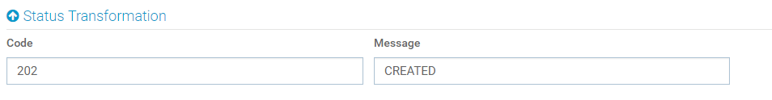

Now let us see a demo for a real-time usecase for Status Transformation in API Gateway. 

#### Sample usecase  - To pass the 302 redirect from Native Service to client. 

When a native service URL has moved permanantly or temporarily, the native service sends a 301 or 302 status code, and also sends the new address in the 'location' header.   However, when API Gateway comes across the 301 or 302 status code, API Gateway reads the status code and the location header, and redirects the request to new address mentioned in the location header. API Gateway, then sends the response from the new address to the client. This is how 3xx status code is handled in API Gateway.  
  
However, now if a customer has a special usecase, where the customer does not want API Gateway doing the redirection, but rather want the clients to receive the 3xx status code, and do the redirection. This can be achieved by status transformation.   

To achieve this, customer should follow the below steps.

1.  Change the native service to send an intermediate 2xx status code instead of 3xx status code, for requests from API Gateway.  
      
    For example, in the attached [redirectDemoNativeService.zip](attachments/redirectDemo.zip) package, the package contains a couple of REST services - source and destination.  
    The REST service 'source' is moved to a new address and so it sends a 301 status along with 'location' header. However it sends 297 status code with the location header for requests from API Gateway (identified using a header 'requestOrigin').  
    The location header contains the address for 'destination', which is the new address of the moved resource.  
      
    
2.  Configure the API Gateway API with a Request Transformation policy to send a request header "requestOrigin" with value "APIGateway". This will help the native service identify the request from API Gateway and send response code '297'.  
      
    For example, import the attached [RedirectionExampleAPI.zip](attachments/RedirectionExampleVS.zip) in API Gateway, you could see that there is a header transformation added in Request processing stage.   
    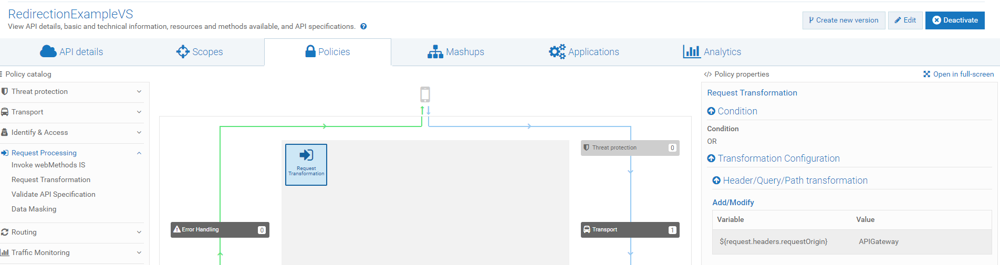
      
    
3.  Configure the API Gateway API with the Response Transformation policy to transform the 297 status code to 301 status code.  
      
    For example, import the attached [RedirectionExampleAPI.zip](attachments/RedirectionExampleVS.zip) in API Gateway, you could see that there is a status transformation added in Response Processing stage, which conditionally transforms status code to 301 when status code is 297.  
      
    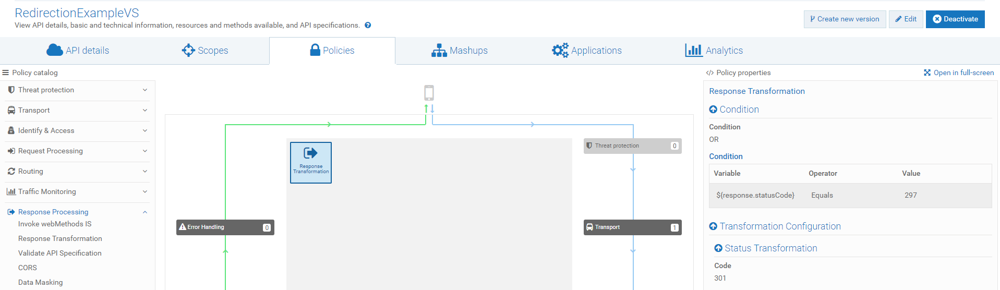  

#### Payload Transformation 

Payload transformation until 10.7 can be done via XSLT transformation or Invoke IS Service policy.  From 10.7, API Gateway allows you to configure the payload directly under Request/Response Transformation policy. (This is also supported in custom extension and conditional error processing policy).

**Steps:**

1.  Under the Payload Transformation section, select the payload type (say json) from available dropdown. Possible values are json, text or xml.
2.  In the payload text area, you can start writing your payload. The syntax helper will highlight the syntax according to the payload type selected in the payload type dropdown. 
3.  You can configure the payload by hardcoding values or you can use any variables inside the payload. Click save.

For example, in the below payload configuration, we have populated the name from request header, id is retained from original payload using jsonpath, ipAddress is populated by system variable inboundIP and we have hardcoded the "populatedBy" field.

   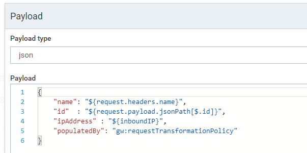

##### XSLT Transformation

While you can directly configure the payload as given above, you can also still configure the XSLT Transformation in Transformation policy as given below.

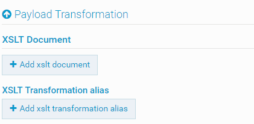

Accepts one or more XSLT Document or XSLT Transformation alias which contains an XSLT document. The XSLT documents are used to transform the payload. 

#### Advanced Transformation

This section accepts an webMethods IS Service or webMethods IS Service Alias as input. You can configure an "Invoke IS Service" under a Transformation policy. The "IS Service" can be used to do advanced transformation along with aforementioned transformations.  

For more details about how to configure webMethods IS Service or webMethods IS Service Alias, refer [Usage of “Invoke webMethods IS” policy - 10.2 and later versions](https://tech.forums.softwareag.com/t/invoke-webmethods-is-policy-in-api-gateway-10-2/237038). 

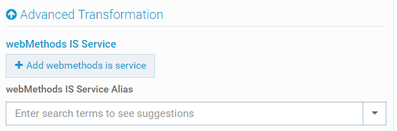

### Transformation Metadata

This section accepts zero or more namespace prefix and namespace URI, which can be used throughout the policy configuration when applying xpath.

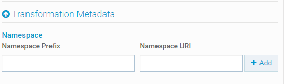

For example, define the prefix as "ns" and some value for the URI.  Now, whenever you use ${request.payload.xpath\[//ns:emp/ns:empName\]} in Transformation Configuration section and/or Condition Section, the URI is applied to the prefix (ns) when applying xpath.

Tryout
======

Please find the attached APIs  **EmployeeManagementService (Version: 3.0)** and **EmployeeManagementService (Version: 3.1)** from downloadable artifacts. You can import them in your API Gateway and try them out.

A Postman collection for this example also provided in the below git-hub page. Clone the repository into your local system.

[https://github.com/Malligarjunan/apigateway/tree/master/postmanCollections/dev-tutorials](https://github.com/Malligarjunan/apigateway/tree/master/postmanCollections/dev-tutorials)

Install Postman and import the Postman collection _**Request and Response Transforamtion Policies in API Gateway.postman\_collection.json**_ from the above git hub link. Now you are ready to invoke the API

Note
====

*   Use **EmployeeManagementService (Version: 3.0)** for **RequestTransformation**
*   Use **EmployeeManagementService (Version: 3.1)** for **ResponseTransformation**

Learn more
==========

*   For more details about usage of Invoke webMethods IS policy in versions 10.2 and above, refer [Usage of “Invoke webMethods IS” policy - 10.2 and later versions](https://tech.forums.softwareag.com/t/invoke-webmethods-is-policy-in-api-gateway-10-2/237038)

Downloadable Artifacts
======================

*   Sample Swagger API file for the sample REST API used in this tutorial  [EmployeeManagementSwagger.json](attachments/EmployeeManagementSwagger.json)
*   [EmployeeManagementService (Version: 3.0)](attachments/EmployeeManagementService_3.0.zip)
*   [EmployeeManagementService (Version: 3.1)](attachments/EmployeeManagementService_3.1.zip)
*   IS Sample services Package [WmEmployeeManagementSample.zip](attachments/WmEmployeeManagementSample.zip)
