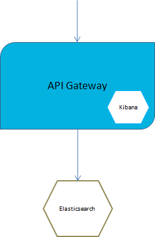
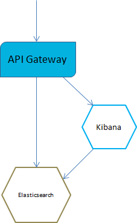
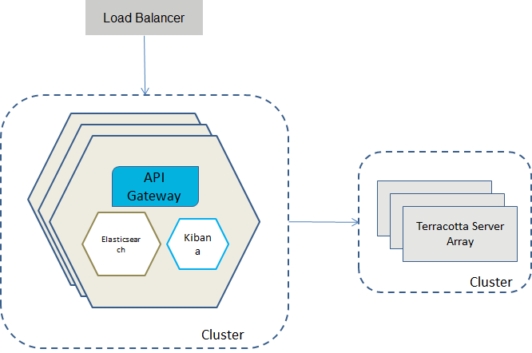
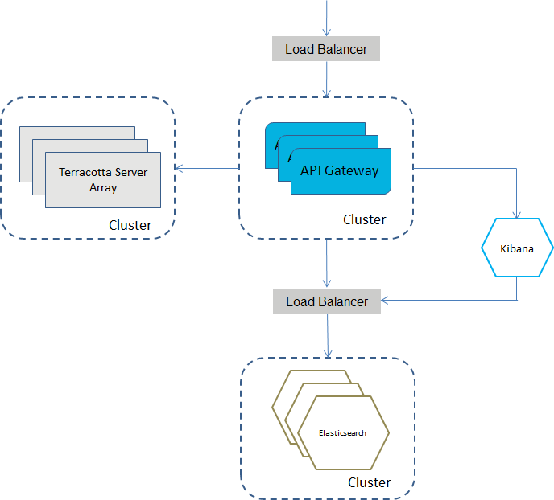

# API Gateway Docker deployment scenarios

Let us see some of the API Gateway Docker deployment scenarios below.

## API Gateway Docker Container with Externalized Elasticsearch and Kibana
The best practices for Docker container specify having a single process per container. This allows to control the components of an API Gateway container and enables horizontal scaling. A full split results into three separate containers, one each for API Gateway, Elasticsearch and Kibana. Since Kibana is not scaled independently it can be included into the API Gateway container.

### API Gateway Container with an Externalized Elasticsearch
The following figure depicts an API Gateway container with an externalized Elasticsearch where Kibana is included in the API Gateway container.



Do the following to set up API Gateway container with an external Elasticsearch:
1. **Run the external Elasticsearch.**
   
   You can start Elasticsearch container by using the Elasticsearch Docker image available on docker hub. The Elasticsearch version should be the same as used in API Gateway
   
   ``` docker run -p 9200:9240 -p 9300:9340 -e "xpack.security.enabled=false" -v es-data:/usr/share/elasticsearch/data docker.elastic.co/elasticsearch/elasticsearch:5.6.4```
   
   Use the option `-e xpack.security.enabled=false` to disable basic authentication for Elasticsearch. This is the default option available in API Gateway.
   
   Use the volume mapping `-v es-data:/usr/share/elasticsearch/data` to persist the Elasticsearch data outside the Docker container.

2. **Build API Gateway Docker image without Elasticsearch.**
   
   To create a Docker file or image for an API Gateway that does not contain Elasticsearch the `apigw_container.sh createDockerFile` and `apigw_container.sh build` command offer the following option:
   
   ```--extern.ES```
   
   Setting the flag ensures that the InternalDataStore is not added to the Docker image created by the generated Docker file.
    
3. **Run API Gateway Docker container.**
    
    Elasticsearch configuration can be injected into an existing API Gateway image during container startup. For example, let's take an existing API Gateway image `sag:apigw`
    
    ```docker run -d -p 5555:5555 -p 9072:9072 --env-file apigw-env.list --hostname apigw --name apigw sag:apigw```
    
    The `apigw-env.list` in the above command contains the environment variables required for configuring an external Elasticsearch and External Kibana:
    
    ```
    apigw_elasticsearch_hosts=host:port
    apigw_elasticsearch_https_enabled=("true" or "false")
    apigw_elasticsearch_http_username=user
    apigw_elasticsearch_http_password=password
    ```
    
    Instead of using the env file to change the environment variables, you can set them using -e options in the Docker run. For setting the Elasticsearch host the Docker run command looks as follows:
    
    ```docker run -d -p 5555:5555 -p 9072:9072 \ -e apigw_elasticsearch_hosts=testhost1:9200 \ --hostname apigw \ --name apigw sag:apigw```
    
### API Gateway Container with an External Elasticsearch and External Kibana

The following figure depicts an API Gateway container with external Elasticsearch and external Kibana containers.



Do the following to set up API Gateway container with an external Elasticsearch and external Kibana:

1. **Run the external Elasticsearch.**
   
   You can start Elasticsearch container by using the Elasticsearch Docker image available on docker hub. The Elasticsearch version should be the same as used in API Gateway
   
   ``` docker run -p 9200:9240 -p 9300:9340 -e "xpack.security.enabled=false" -v es-data:/usr/share/elasticsearch/data docker.elastic.co/elasticsearch/elasticsearch:5.6.4```
   
   For more information on `-e xpack.security.enabled=false` and `-v es-data:/usr/share/elasticsearch/data` refer previous section.
   
2. **Run the external Kibana**

   If you have modified the original Kibana, for example by adding a style sheet file, or modified the kibana.yml file, as per your requirements, then this customization of Kibana is bundled with API Gateway. This customized Kibana is provided under the directory: profiles/IS_default/apigateway/dashboard. To achieve this, create and run a Docker image based on the customization. This can be achieved by a Docker file as follows:
   
   ```
   FROM centos:7
   COPY /opt/softwareag/profiles/IS_default/apigateway/dashboard /opt/softwareag/kibana
   EXPOSE 9405
   RUN chmod 777 /opt/softwareag/kibana/bin/kibana
   CMD /opt/softwareag/kibana/bin/kibana
   ```
   
   Build and run the Docker file as follows:
   
   ```
   docker build -t sagkibana .
   docker run -p 9405:9405 sagkibana
   ```
   
3. **Run API Gateway Docker container**
   
   To run a Docker image for an API Gateway running against an external Kibana the Docker run can be called with the following environment variable which can be used with the -e option or using the env file (discussed in previous examples)
   
   ```apigw_kibana_dashboardInstance=instance```
   
### API Gateway Container Cluster Configuration
   
You can combine API Gateway Docker containers to form a cluster. To configure an API Gateway Docker container cluster:

1. **Configure loadbalancer on the Docker host.**

2. **Configure Terracotta Server Array.**
   API Gateway requires a Terracotta Server Array installation. For details, see Terracotta documentation (https://www.terracotta.org/). The Terracotta Server Array on its own can be deployed as a Docker container.
   
3. **Create the basic API Gateway Docker image.**
For details on creating the API Gateway Docker image, see [API Gateway Docker Images](https://github.com/SoftwareAG/webmethods-api-gateway/tree/deploymentscripts/samples/docker#api-gateway-docker-images)

4. **Create cluster API Gateway Docker image and enhance it with the cluster configuration in one of the following ways:**
   
   * Clustered all-in-one containers that consist of API Gateway, Elasticsearch, and Kibana.
   
   * Clustered API Gateway containers with externalized Elasticsearch and Kibana containers.
   
#### Clustered all-in-one Containers that consist of API Gateway, Kibana and Elasticsearch
Although API Gateway clusters with externalized Elasticsearch is the preferred approach API Gateway all-in-one containers can also be clustered.

`Note: Having external Kibana is an optional variation.`

The following diagram depicts clustering based on all-in-one containers.



The all-in-one containers hold API Gateway, Kibana and Elasticsearch. The clustering is done through a Terracotta Server Array and the cluster capabilities of the embedded Elasticsearch instances.

The required settings for the cluster configuration can be injected during Docker run through an environment file. A sample environment file looks as follows.

```
apigw_cluster_tsaUrls=tc:9510
apigw_terracotta_license_filename=terracotta-license.key
apigw_discovery_zen_ping_unicast_hosts=apigw1:9340,apigw2:9340,apigw3:9340
```

#### Clustered API Gateway Containers with externalized Elasticsearch and Kibana containers

The API Gateway containers are clustered. They are talking to a clustered Terracotta Server Array container and to a cluster of Elasticsearch container through a loadbalancer. The Elasticsearch loadbalancer is also providing the Elasticsearch endpoint for the Kibana containers

`Note: The externalized Kibana is optional. You can still run Kibana within the API Gateway container.`

The following diagram depicts clustering API Gateway containers with externalized Elasticsearch and Kibana containers



To cluster the API Gateway with external containers for Elasticsearch, Kibana, and Terracotta Server Array, the settings can be injected into an API Gateway Docker image by providing an environment file. The environment file needs to define the following environment variables.

```
apigw_cluster_tsaUrls=host:port
apigw_terracotta_license_filename=license-key-filename
apigw_elasticsearch_hosts=host:port
apigw_elasticsearch_http_username=user
apigw_elasticsearch_http_password=password
apigw_kibana_dashboardInstance=instance
```

# Running API Gateway Docker Containers with Docker Compose

You can run API Gateway Docker containers and use Docker Compose's ability to allow you to define and run multi-container Docker applications in your deployment environment. The API Gateway installation provides sample Docker Compose files in the folder given below.

`SAG_Root/IntegrationServer/instances/default/packages/WmAPIGateway/resources/samples/docker-compose`

The API Gateway installation provides the following three sample Docker Compose files:
* apigw-elasticsearch-no-cluster.yml : An API Gateway instance with an Elasticsearch containter.

* apigw-elasticsearch-cluster.yml : An API Gateway cluster with three API Gateway containers, three clustered Elasticsearch containers and a Terracotta container.

* apigw-elasticsearch-cluster-kibana.yml : Containers of an API Gateway cluster and a Kibana container.

The Docker Compose files can be parameterized through environment variables.
