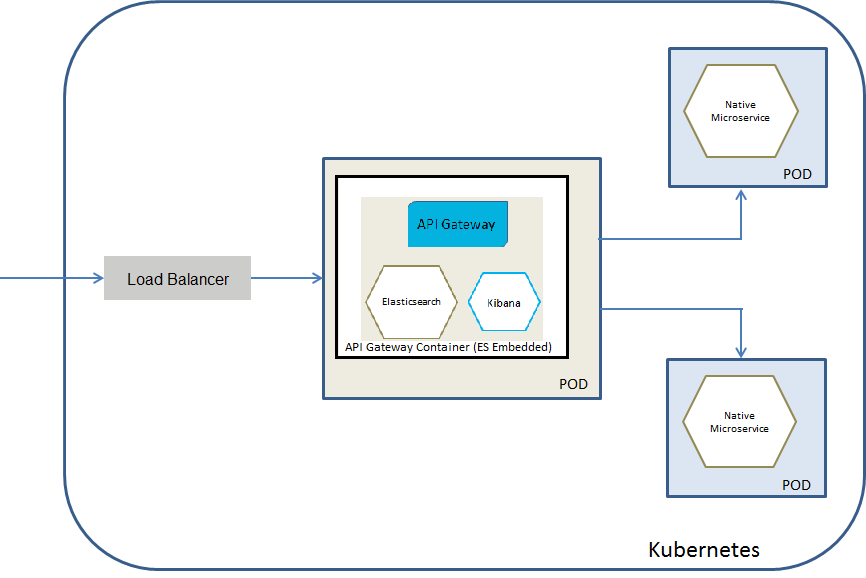

## Deploying API Gateway Pod with API Gateway and Elasticsearch Containers

You can select this deployment model if you want API Gateway as a Kubernetes service protecting the native services deployed to Kubernetes. Here, API Gateway runs in dedicated pods, and each pod has Elasticsearch and Kibana containers. API Gateway routes the incoming API requests to the native services. The invocation of the native services by the consumers happens through APIs provisioned by API Gateway.

The below figure depicts the API Gateway Kubernetes service deployment model where you have a single API Gateway pod that contains API Gateway and Elasticsearch containers. The Kibana can either be embedded in the API Gateway container or can reside as a separate container within the pod.



Do the following steps to deploy API Gateway Kubernetes pod that contains an Elasticsearch container

1. Ensure that vm.max_map_count is set to a value of at least 262144 to run an Elasticsearch container within a pod. This is done in an init container as follows:

    ```
   initContainers:
   - command:
      - sysctl
      - -w
      - vm.max_map_count=262144
      image: busybox
      imagePullPolicy: IfNotPresent
      name: init-sysctl
      resources: {}
      securityContext:
         privileged: true
   ```
   
2. Ensure that you have an API Gateway Docker image and an Elasticsearch image for this deployment. For the API Gateway container, you have to set the following environment:

```
   apigw_elasticsearch_hosts=localhost:9200
```

This assumes that Elasticsearch runs on the standard port 9200 and the xpack.security is disabled. You can disable the xpack.security by setting the environment variable xpack.security.enabled to false. The following YAML snippet displays how the environment variable apigw_elasticsearch_hosts is set.

   ```
   spec:
      containers:
      - env:
         - name: apigw_elasticsearch_hosts
         value: localhost:9200
   ```

3. Run the following command to deploy API Gateway in the Kubernetes setup:

   ```
   kubectl create -f api-gateway-deployment-embedded-elasticsearch.yaml
   ```
   
   Ensure that you have specified the required information such as image name, default ports in the Kubernetes sample file [api-gateway-deployment-embedded-elasticsearch.yaml](). For details on Kubernetes YAML files, see Kubernetes documentation. This now pulls the image specified and creates the API Gateway pod with API Gateway and Elasticsearch containers. Run the command kubectl get pods to view the pods created.

