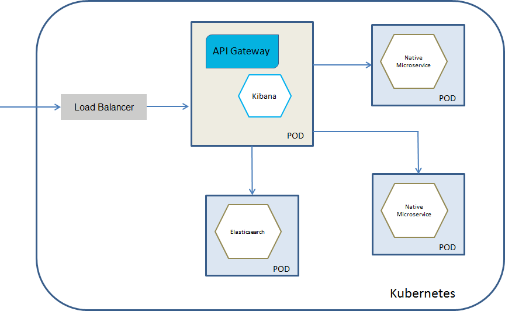

## Deploying API Gateway Pod with API Gateway Container connected to an Elasticsearch Kubernetes Service

You would select this deployment model if you want to have a separate Elasticsearch service. This deployment allows you to scale Elasticsearch independently or to use an already existing Elasticsearch service. Ensure you have an Elasticsearch Kubernetes service for Elasticsearch 7.2.0.

The below diagram depicts the API Gateway Kubernetes service deployment model where you have a separate API Gateway pod that constitutes an API Gateway container connected to an Elasticsearch service. Kibana can run as a separate container within the API Gateway pod or can be embedded in the API Gateway container.



Do the following stesps to deploy an API Gateway Kubernetes pod that communicates with an Elasticsearch Kubernetes service

1. Ensure you have an Elasticsearch Kubernetes service for Elasticsearch 7.2.0.

   For more details on deploying Elasticsearch on Kubernetes, see Elasticsearch and Kubernetes documentation.

2. Ensure you have an API Gateway Docker image for this deployment. For the API Gateway container, you have to set the following environment variable:

   ``` apigw_elasticsearch_hosts=elasticsearch-host:elasticsearch-port ```

3. Run the following command to deploy API Gateway in the Kubernetes setup:

``` kubectl create -f api-gateway-deployment-external-elasticsearch.yaml ```

   Ensure that you have specified the required information such as container name, the path to your API Gateway image stored in a docker registry, container port, details of the external elastic search and how to access it in the Kubernetes sample file  [api-gateway-deployment-external-elasticsearch.yaml](api-gateway-deployment-external-elasticsearch.yaml). For details on Kubernetes YAML files, see Kubernetes documentation. 
   
   This now pulls the image specified and creates the API Gateway pod with API Gateway container connected to an Elasticsearch Kubernetes service.
   
Run the command `kubectl get pods` to view the pods created.
